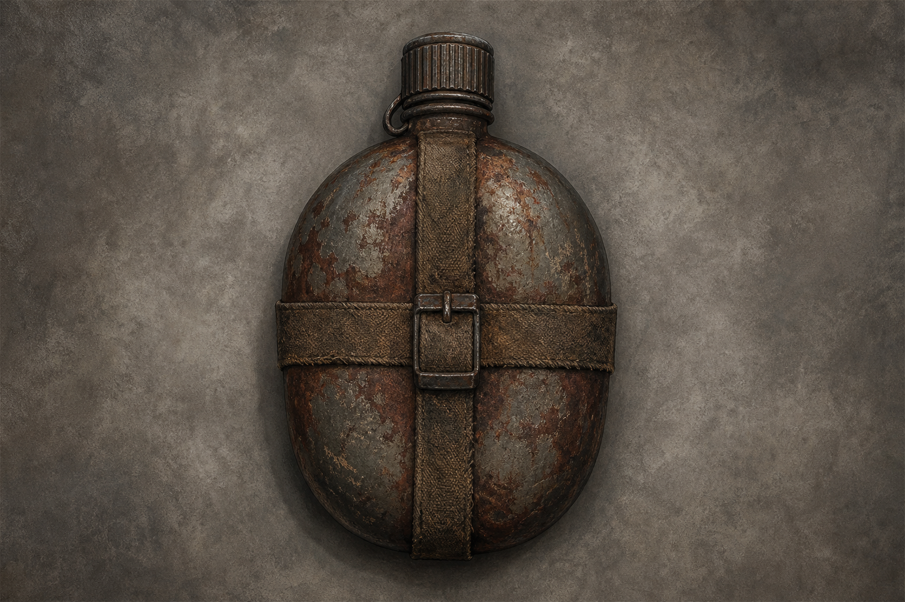
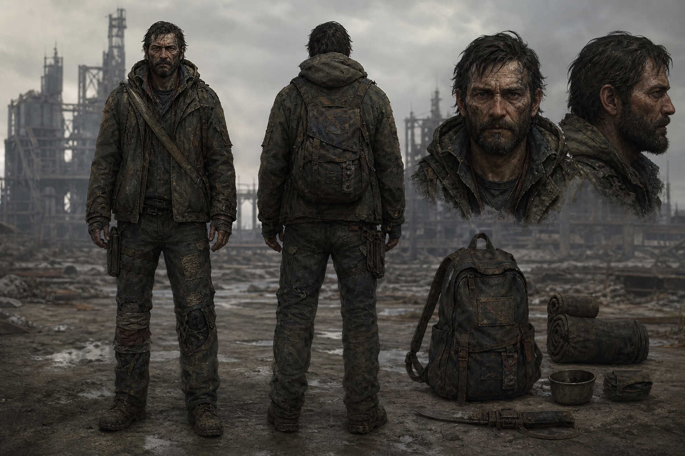
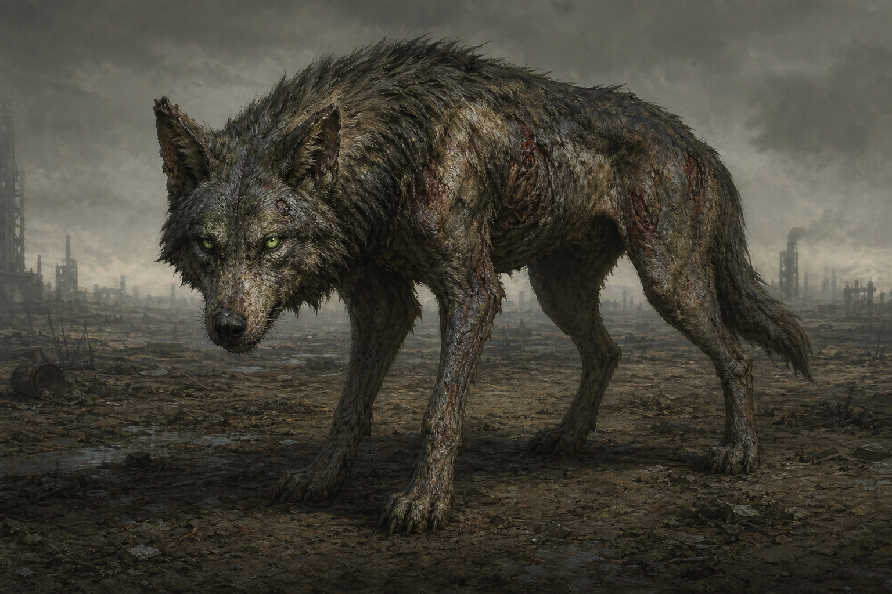
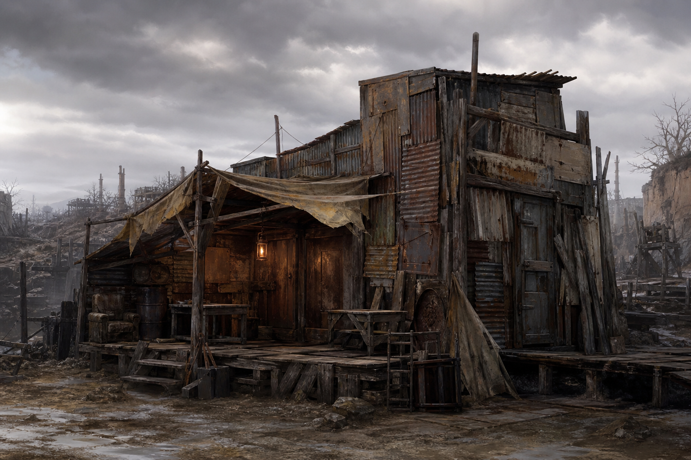

# 游戏美术统一风格

> 所有 AI 出图（Midjourney、ComfyUI、SD Forge 等）与人工约稿均须遵循本文档。  
> 每张资产须附带 sidecar：`同名.prompt.json`（见文末格式）。

---

## 世界观

废土末日生存风格。

文明崩塌后的荒野世界，资源稀缺，工业设施废弃，整体压抑、孤独、生存感强。

---

## 主视觉风格

- 半写实插画
- 暗黑废土
- 低饱和度
- 手绘质感
- 轻微脏污感
- 材质老旧
- 禁止高科技未来感
- 禁止二次元萌系
- 禁止高饱和颜色

---

## 色调

**主色：**

- 灰色
- 土黄
- 暗绿
- 铁锈红
- 深棕

**避免：**

- 荧光色
- 纯蓝
- 纯粉
- 高亮彩色

---

## 光影

- 阴天环境
- 柔和自然光
- 禁止强烈霓虹
- 禁止赛博朋克灯光

---

## 卡牌插图规则

- 单物体居中
- 统一顶部视角
- 背景简单
- 边缘清晰
- 保持卡牌可读性

---

## 风格参考插图

以下示例已按本文档生成，出图时应对齐其色调、质感与构图。每张图配有 `*.prompt.json` sidecar。

| 类型 | 参考图 | 说明 |
|------|--------|------|
| 卡牌物品 |  | 顶视、单物体、背景极简 |
| 角色 |  | 幸存者、破旧功能装 |
| 怪物 |  | 轻度变异、无克苏鲁 |
| 建筑 |  | 铁皮木拼、临时避难所 |

**资产目录规范**

```
docs/art-style/references/     # 风格参考（本文档用，勿直接进游戏包体）
web/public/assets/cards/       # 正式卡牌插图（512×512 推荐）
web/public/assets/world/       # 牌桌放置态世界精灵（植物/建筑等，见下文）
web/public/assets/scenes/      # 游戏场景背景（如 wasteland_board.png）
web/public/assets/characters/
web/public/assets/monsters/
web/public/assets/buildings/
```

| 用途 | 推荐尺寸 | 比例 |
|------|----------|------|
| 卡牌插图 | 512×512 | 1:1 |
| **牌桌放置态（world_sprite）** | **768×512** | **3:2** |
| 角色立绘 | 512×768 | 2:3 |
| 怪物 | 640×480 | 4:3 |
| 建筑/场景 | 960×540 | 16:9 |
| UI 图标 | 128×128 | 1:1 |

正式资源命名：`{category}/{cardId}.png` + `{cardId}.prompt.json`，并在 `starter.json` 中通过 `artKey` 引用纹理键。

**牌桌放置态**命名：`assets/world/{cardId}_world.png` + 同名 `.prompt.json`；卡牌 JSON 通过 `placedVisual.spriteId` 引用（见 [牌桌放置态世界精灵](#牌桌放置态世界精灵world_sprite)）。

---

## 牌桌放置态世界精灵（world_sprite）

> 逻辑仍是卡牌；**拖起 = 卡面 UI**，**放下 = 世界精灵**。参考实现：`plant_thornvine` / `plant_thornvine_world`。

### 交互与表现

| 状态 | 表现 |
|------|------|
| 拖拽中 | 标准 `GameCard` 卡面 |
| 放置于牌桌（栈底） | 隐藏卡框，显示 `assets/world/` 精灵 |
| 作为叠放成员 | 保持卡面（不显示世界精灵） |

### 图片规格（必须遵守）

| 项目 | 规范 |
|------|------|
| **目录** | `web/public/assets/world/` |
| **命名** | `{cardId}_world.png` + `{cardId}_world.prompt.json` |
| **分辨率** | **768 × 512**（3:2） |
| **文件大小** | **≤ 100 KB**（优化后目标 ~100–150 KB） |
| **透明背景** | **真 PNG Alpha**；禁止把灰白棋盘格画进像素 |
| **锚点** | 脚底居中；主体居中，四周留透明边距 |
| **视角** | 轻微俯视 3/4（与废土牌桌一致），单物体、轮廓清晰 |

出图后处理（入库前）：

1. 去除假透明（白/浅灰棋盘格）→ 真透明
2. 缩放到 **768×512**（若 AI 出图为 1536×1024 等）
3. 压缩 PNG（pngquant 等），确认 **≤ 100 KB**

### Prompt 追加片段（world_sprite）

在「基础模板」之后追加：

```
single plant or structure centered, slight top-down 3/4 view,
transparent background, clear silhouette, no card frame, no text,
feet at bottom center, wasteland survival board game prop
```

**Negative 额外禁止**：`checkerboard background, white background, grey grid, fake transparency`

### Sidecar 示例

`web/public/assets/world/plant_thornvine_world.prompt.json`：

```json
{
  "styleDoc": "docs/art-style-prompt.md",
  "assetType": "world_sprite",
  "positive": "post-apocalyptic survival card game illustration, dark muted colors, hand-painted texture, rusty worn materials, semi-realistic, consistent lighting, mutant thornvine plant, twisted dark olive vines with rusted metal thorns, single plant centered, slight top-down 3/4 view, transparent background, clear silhouette, no card frame, no text",
  "negative": "neon lights, cyberpunk, high saturation, anime, chibi, checkerboard background, white background, text, watermark, UI, card border",
  "aspectRatio": "3:2",
  "recommendedSize": "768x512",
  "tool": "comfyui",
  "notes": "牌桌放置态；缺 PNG 时回退程序帧"
}
```

| 字段 | 说明 |
|------|------|
| `assetType` | 固定 `world_sprite` |
| `recommendedSize` | 固定 `768x512` |
| `aspectRatio` | 固定 `3:2` |

### 游戏内缩放公式

牌面显示宽度目标约 **120–150 px**（略高于 slim 卡 44×72）：

```
defaultScale = 目标显示宽度(px) / 源图宽度(px)
```

示例：768 宽源图、目标 138 px 宽 → `defaultScale = 0.18`（写在 `worldSpriteManifest.ts`）。

`feetOffsetY`：精灵原点相对卡牌中心的 Y 偏移（slim 卡默认 **34**），按脚底对齐微调。

### 代码接入清单（新元素）

1. `web/public/assets/world/{id}_world.png` + `.prompt.json`
2. `web/src/art/worldSpriteManifest.ts` — 注册 manifest 条目（`singleImage: true`, `tweenSway: true` 为默认）
3. `web/src/art/worldSpriteKeys.ts` — 纹理/动画 key（若新增）
4. `web/public/data/cards/deck_*.json` — 卡牌加 `placedVisual: { "spriteId": "{id}_world" }`
5. 可选：`ThornvineWorldFrames.ts` 类程序帧作 PNG 加载失败回退

运行时：`PreloaderScene` 加载 PNG → `stripWorldSpriteBackground` 去浅底 → `PlacedVisualSystem` 切换卡面/精灵。

---

## 建筑风格

- 铁皮
- 木头
- 废旧工业
- 拼装感
- 临时避难所风格

---

## 角色风格

- 幸存者风格
- 衣服破旧
- 功能性优先
- 禁止时尚感

---

## 怪物风格

- 轻度变异
- 动物与辐射结合
- 不走克苏鲁触手路线

---

## UI 风格

- 简洁
- 废土工业 UI
- 旧仪表盘风格
- 金属纹理
- 避免科幻 HUD

---

## Prompt 基础模板（英文，置于每条 prompt 前部）

```
post-apocalyptic survival card game illustration,
dark muted colors,
hand-painted texture,
rusty worn materials,
semi-realistic,
top-down item card art,
simple background,
consistent lighting
```

### 按类型追加片段

| 类型 | 追加英文关键词 |
|------|----------------|
| 卡牌物品 | `single object centered, top-down view, clear silhouette, minimal background`（对齐参考：`art-style/references/card-item-canteen.png`） |
| 建筑/场景 | `scrap metal, wood planks, improvised shelter, abandoned industrial` |
| 角色 | `wasteland survivor, worn functional clothing, no fashion` |
| 怪物 | `mild mutation, irradiated animal, no tentacles, no eldritch horror` |
| **牌桌放置态** | `single plant or structure centered, slight top-down 3/4 view, transparent background, clear silhouette, no card frame`（详见 world_sprite 章节） |
| UI 素材 | `wasteland industrial UI, old gauge dashboard, metal texture, not sci-fi HUD` |

---

## 统一 Negative Prompt（英文）

生成时必须附带（可按工具删减）：

```
neon lights, cyberpunk, sci-fi futuristic, high saturation, fluorescent colors,
pure blue, pure pink, bright colorful, anime, chibi, cute moe,
clean shiny metal, fashion model, luxury, tentacles, eldritch, cosmic horror,
strong rim light, hologram, laser, spaceship, clean lab
```

---

## Sidecar 格式（`*.prompt.json`）

与图片同目录，例如 `assets/cards/wood_axe.png` → `assets/cards/wood_axe.prompt.json`：

```json
{
  "styleDoc": "docs/art-style-prompt.md",
  "assetType": "card_item",
  "positive": "post-apocalyptic survival card game illustration, dark muted colors, hand-painted texture, rusty worn materials, semi-realistic, top-down item card art, simple background, consistent lighting, rusty axe, single object centered",
  "negative": "neon lights, cyberpunk, sci-fi futuristic, high saturation, anime, chibi, tentacles, eldritch",
  "aspectRatio": "1:1",
  "tool": "comfyui",
  "workflow": "assets/workflows/comfyui/card_item.json",
  "seed": null,
  "notes": "可选：迭代说明"
}
```

| 字段 | 必填 | 说明 |
|------|------|------|
| `styleDoc` | 是 | 固定引用本文档路径 |
| `assetType` | 是 | `card_item` \| `character` \| `monster` \| `building` \| `world_sprite` \| `ui` |
| `positive` | 是 | 完整正向 prompt（含基础模板 + 主体描述） |
| `negative` | 是 | 完整负向 prompt |
| `aspectRatio` | 是 | 卡牌物品建议 `1:1` |
| `tool` | 否 | `comfyui` \| `midjourney` \| `forge` 等 |
| `workflow` | 否 | ComfyUI 工作流路径 |
| `seed` | 否 | 复现用 |

---

## 自检清单（出图前）

- [ ] 正向 prompt 以「基础模板」开头
- [ ] 已附统一 negative
- [ ] 色调在主色范围内，无禁止色
- [ ] 卡牌类：单物体、顶视、背景简单
- [ ] **world_sprite 类：768×512、≤100KB、真透明、已写 sidecar**
- [ ] 已写 sidecar JSON，且 `styleDoc` 指向本文档
