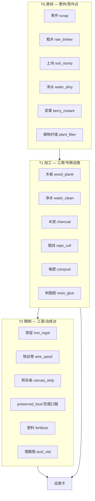
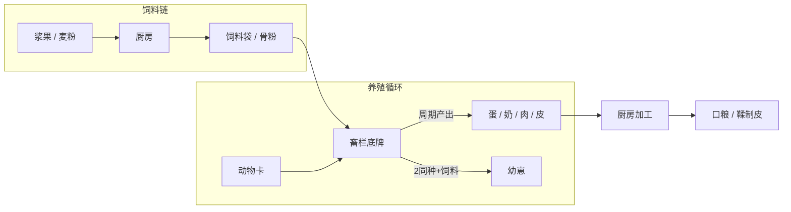

# 卡牌扩展设计 — 基础材料 · 植物 · 设施

> 在现有 ~40 张卡基础上扩展至 **~100 张** playable 卡（不含敌人）  
> 合成规则见 [facility-craft-design.md](facility-craft-design.md)：**材料叠入设施，幸存者不参与**  
> 养殖规则：**动物 + 饲料叠入畜栏**，幸存者不参与；与劳作点（需幸存者）区分  
> 牌形规范见 [card-decks-design.md](card-decks-design.md)

---

## 1. 设计目标

| 目标 | 做法 |
|------|------|
| 材料有层次 | 原材 → 加工品 → 精制品，3 档递进 |
| 植物有分支 | 普农（温饱）/ 污壤（战斗）/ 野外采撷，互不替代 |
| 养殖有闭环 | 畜栏 + 动物 + 饲料 → 产出；同种成对 → 繁殖 |
| 设施有分工 | 工房、设计院外再拆 **专精设施**，避免一张卡包打天下 |
| 数值线性 | 工时 6–20s，材料档 +1 则工时 +2～4s |
| 稀缺可控 | 野外采尽、月相解锁、商店溢价 |

---

## 2. 材料分层（Material Tiers）



### 2.1 标签体系（Recipe 可匹配 tag）

| tag | 含义 | 示例卡 |
|-----|------|--------|
| `material_raw` | 未加工原材 | scrap, raw_timber, soil_clump |
| `material` | 基础建材 | wood_plank, rope_coil, charcoal |
| `material_refined` | 精制中间品 | iron_ingot, wire_spool, canvas_strip |
| `metal` | 金属系 | scrap, iron_ingot, wire_spool |
| `wood` | 木质系 | raw_timber, wood_plank, charcoal |
| `organic` | 有机系 | berry, compost, plant_fiber |
| `fiber` | 纤维系 | plant_fiber, rope_coil, canvas_strip |
| `chemical` | 化学系 | resin_glue, acid_vial |
| `food` | 可食用 | berry, canned_food, preserved_food |
| `feed` | 饲料 | feed_bag, mash_feed, bone_meal |
| `animal` | 可养殖动物 | rust_hen, scrap_goat |
| `animal_product` | 畜产 | egg_mutant, raw_meat, goat_milk |
| `poultry` / `livestock` / `guard_beast` | 畜种分支 | 鸡 / 羊猪兔 / 犬 |
| `water_raw` / `water` | 水 | water_dirty / water_clean |

---

## 3. 基础材料卡（新增 + 保留）

### 3.1 保留（13 → 仍用，部分改标签）

| id | 名称 | 变更 |
|----|------|------|
| scrap | 零件 | 加 `material_raw`, `metal` |
| wood_plank | 木板 | 加 `wood` |
| soil_clump | 土块 | 已有 `soil` |
| water_dirty / water_clean | 浑水 / 净水 | 不变 |
| berry_mutant | 变异浆果 | 加 `organic` |
| feed_bag | 饲料袋 | 不变 |
| canned_food | 应急罐头 | 不变 |
| caps | 筹码 | 不变 |

### 3.2 T0 原材（新增 8 张 · compact）

| id | 名称 | tags | 主要来源 |
|----|------|------|----------|
| `raw_timber` | 粗木段 | resource, material_raw, wood | 枯木林改产粗木；工房屋顶不直出木板 |
| `plant_fiber` | 植物纤维 | resource, material_raw, fiber, organic | 芦苇丛、锈蚀灌木副产 |
| `stone_chunk` | 石砾 | resource, material_raw | 新野外「砾石滩」 |
| `rust_shard` | 锈铁片 | resource, material_raw, metal | 矿脉低概率副产、怪物掉落 |
| `mushroom_cap` | 变异菇帽 | resource, food, organic | 菇床劳作点 |
| `reed_stalk` | 芦苇杆 | resource, material_raw, fiber | 新野外「芦苇泽」 |
| `tar_blob` | 沥青块 | resource, material_raw, chemical | 月相≥3 掉落 |
| `glass_shard` | 玻璃碎 | resource, material_raw | 商店、掉落 |

> **枯木林调整**：产出 `raw_timber`（12s/次），木板改由工房 `粗木×2 → 木板×1`（8s），形成明确加工链。

### 3.3 T1 加工品（新增 10 张 · compact）

| id | 名称 | tags | 工房配方（示例） |
|----|------|------|------------------|
| `charcoal` | 木炭 | material, wood | 粗木×2 → 木炭×2（10s） |
| `rope_coil` | 粗麻绳 | material, fiber | 植物纤维×3 → 粗麻绳×1（8s） |
| `compost` | 堆肥 | material, organic, soil | 浆果×2 + 土块×1 → 堆肥×1（10s） |
| `resin_glue` | 树脂胶 | material, chemical | 沥青×1 + 植物纤维×2 → 树脂胶×1（12s） |
| `scrap_bundle` | 零件捆 | material, metal | 零件×3 → 零件捆×1（6s，便于叠放） |
| `plank_bundle` | 木板捆 | material, wood | 木板×3 → 木板捆×1（6s） |
| `salt_crystal` | 盐晶 | material, chemical | 浑水×3 + 木炭×1 → 盐晶×1（14s） |
| `tanned_hide` | 鞣制皮 | material, fiber | 饲料×1 + 树脂胶×1 → 鞣制皮×1（12s） |
| `brick_clay` | 粘土砖 | material | 土块×2 + 净水×1 → 粘土砖×2（10s） |
| `nail_box` | 钉盒 | material, metal | 零件×2 + 木炭×1 → 钉盒×1（10s） |

### 3.4 T2 精制品（新增 8 张 · compact）

| id | 名称 | tags | 设施 | 配方（示例） |
|----|------|------|------|--------------|
| `iron_ingot` | 铁锭 | material_refined, metal | **冶炼台** | 锈铁片×2 + 木炭×2 → 铁锭×1（14s） |
| `wire_spool` | 铁丝卷 | material_refined, metal | 冶炼台 | 铁锭×1 + 零件×1 → 铁丝卷×1（10s） |
| `canvas_strip` | 帆布条 | material_refined, fiber | 工房 | 粗麻绳×2 + 鞣制皮×1 → 帆布条×1（12s） |
| `preserved_food` | 防腐口粮 | food | **厨房** | 浆果×2 + 盐晶×1 → 防腐口粮×2（10s） |
| `fertilizer` | 变异肥料 | material_refined, soil | 工房 | 堆肥×1 + 变异菇帽×1 → 肥料×1（12s） |
| `acid_vial` | 强酸瓶 | material_refined, chemical | 工房 | 变异菇帽×2 + 玻璃碎×1 → 强酸瓶×1（14s） |
| `fuel_can` | 燃料罐 | material_refined, chemical | 冶炼台 | 沥青×1 + 强酸瓶×1 → 燃料罐×1（16s，月相≥4） |
| `blueprint_chip` | 蓝图芯片 | material_refined | 工房 | 玻璃碎×2 + 铁丝卷×1 → 蓝图芯片×1（18s） |

**材料卡小计**：保留 8 张常用 + 新增 26 张 ≈ **34 张材料/消耗品**（含 caps、种子）。

---

## 4. 植物卡（新增 + 保留）

### 4.1 三类植物线

| 线路 | 场地 | 种子 tag | 产出定位 |
|------|------|----------|----------|
| **普农** | `farmland` 农田 | `seed`, `farm` | 食物、纤维、饲料 |
| **污壤** | `blight_plot` 污壤 | `mutant_seed` | 战斗植物、劣变风险 |
| **采撷** | `worksite` 节点 | — | 浆果、菇帽、芦苇，不占地 tile |

### 4.2 场地卡（defense / facility · tile / wide）

| id | 名称 | shape | tags | 说明 |
|----|------|-------|------|------|
| `blight_plot` | 污壤 | tile | blight_plot, building | **保留**，变异战斗 |
| `farmland` | 规整农田 | tile | farmland, building | **新增**，普农专用 |
| `mushroom_bed` | 菇床 | wide | worksite, resource_node, building | **新增**，产菇帽，需幸存者 |
| `reed_patch` | 芦苇丛 | wide | worksite, resource_node, building | **新增**，产芦苇杆 |

### 4.3 种子（compact · seed）

| id | 名称 | tags | 种在哪 | 长成（growth 表） |
|----|------|------|--------|-------------------|
| `seed_thornvine` | 变异种子·刺藤 | mutant_seed | 污壤 | plant_thornvine / weed |
| `seed_spore` | 变异种子·孢菇 | mutant_seed | 污壤 | plant_sporegun / weed |
| `iron_wheat_seed` | 铁根麦种 | seed, farm | 农田 | iron_wheat_crop |
| `seed_sun_pod` | 锈向日葵种 | seed, farm | 农田 | crop_sun_pod |
| `seed_reed` | 水芦苇种 | seed, farm | 农田 | reed_stalk ×2 |
| `seed_cactus` | 刺掌种 | seed, farm | 农田 | crop_cactus_pad |
| `seed_mycelium` | 菌丝种 | seed, farm | 农田 / 菇床 | mushroom_cap |

### 4.4 成株 / 攻击植物

| id | 名称 | shape | tags | 效果概要 |
|----|------|-------|------|----------|
| `plant_thornvine` | 锈刺藤 | slim | attack_plant | **保留** 近程 |
| `plant_sporegun` | 孢子弹匣菇 | standard | attack_plant | **保留** 远程 |
| `plant_weed` | 杂草 | compact | plant | **保留** 劣变 |
| `plant_snare_root` | 缠足根 | slim | attack_plant | **新增** 减速 30%，低伤 |
| `plant_acid_bloom` | 酸蚀花 | standard | attack_plant | **新增** 消耗 acid_vial 叠上激活，高伤 |
| `iron_wheat_crop` | 铁根麦 | compact | crop, food | **新增** 可拖厨房 → 麦粉 |
| `crop_sun_pod` | 锈向日葵盘 | compact | crop, organic | **新增** 工房 → 植物纤维 |
| `crop_cactus_pad` | 刺掌片 | compact | crop, material_raw | **新增** 工房 → 植物纤维 |

### 4.5 生长表扩展 `mutant_outcomes.json`

```json
{
  "growth_thornvine": [
    { "result": "plant_thornvine", "weight": 65 },
    { "result": "plant_snare_root", "weight": 15 },
    { "result": "plant_weed", "weight": 15 },
    { "result": "fail_contaminate", "weight": 5 }
  ],
  "growth_spore": [
    { "result": "plant_sporegun", "weight": 60 },
    { "result": "plant_acid_bloom", "weight": 20 },
    { "result": "plant_weed", "weight": 15 },
    { "result": "fail_contaminate", "weight": 5 }
  ],
  "growth_farmland_wheat": [
    { "result": "iron_wheat_crop", "weight": 85 },
    { "result": "plant_weed", "weight": 15 }
  ],
  "growth_farmland_sun": [
    { "result": "crop_sun_pod", "weight": 80 },
    { "result": "plant_fiber", "weight": 20 }
  ]
}
```

**植物卡小计**：场地 4 + 种子 7 + 成株 10 ≈ **21 张**（含保留）。

---

## 5. 动物卡牌与养殖

### 5.1 设计原则

| 项 | 规则 |
|----|------|
| **与合成区分** | 设施合成 = 材料叠入工房/设计院；养殖 = **动物 + 饲料** 叠入畜栏 |
| **幸存者** | **不参与** 养殖（与设施合成一致）；采饲料仍靠厨房 / 农田 |
| **消耗** | 每周期从堆内 **扣除饲料** member；动物与畜栏底牌 **不消耗** |
| **繁殖** | 同畜栏内 **同种动物 ≥2** + 额外饲料 → 幼崽进手牌（长周期） |
| **上限** | 每种畜栏 `maxAnimals` 限制堆内动物数，防无限刷 |
| **战斗** | 看门犬等 `guard_beast` 可离栏跟随（复用 `guard_unit`），畜栏内仅繁殖不产出 |



### 5.2 畜栏场地（defense · wide / tile）

| id | 名称 | shape | tags | 接纳 | max | 说明 |
|----|------|-------|------|------|-----|------|
| `chicken_coop` | 鸡舍 | wide | ranch, building, poultry_pen | `poultry` | 4 | **保留**，产蛋 |
| `goat_pen` | 锈铁羊圈 | wide | ranch, building, livestock_pen | `livestock` | 3 | 产奶 + 兽皮 |
| `rabbit_hutch` | 兔笼 | wide | ranch, building, livestock_pen | `livestock` | 6 | 快周期、少肉，易繁殖 |
| `pig_sty` | 废料猪栏 | wide | ranch, building, livestock_pen | `livestock` | 2 | 慢周期、大肉量 |
| `kennel` | 犬舍 | tile | ranch, building, guard_pen | `guard_beast` | 2 | 繁殖看门犬，栏内不产战斗单位 |
| `insect_crate` | 虫箱 | wide | ranch, building, poultry_pen | `poultry` | 8 | 产虫胶（化学系），月相≥4 |

畜栏 JSON 效果模块 `ranch_pen`（由 `RanchSystem` 处理，类比 `WorkSiteSystem`）：

```json
{
  "type": "ranch_pen",
  "acceptTags": ["poultry"],
  "maxAnimals": 4,
  "produce": {
    "outputCardId": "egg_mutant",
    "intervalSeconds": 14,
    "feed": [{ "tag": "feed", "count": 1 }]
  },
  "breed": {
    "sameTag": "poultry",
    "minCount": 2,
    "outputCardId": "chick_rust",
    "intervalSeconds": 28,
    "feed": [{ "tag": "feed", "count": 2 }]
  }
}
```

### 5.3 动物卡（resource / attack · standard）

| id | 名称 | deck | tags | 畜栏 | 说明 |
|----|------|------|------|------|------|
| `chick_rust` | 锈羽雏鸡 | resource | animal, poultry, juvenile | 鸡舍 | 幼体；繁殖产出 |
| `hen_rust` | 锈羽母鸡 | resource | animal, poultry | 鸡舍 | 商店 / 掉落 |
| `goat_scrap` | 废土山羊 | resource | animal, livestock | 羊圈 | 产奶 |
| `rabbit_iron` | 铁耳兔 | resource | animal, livestock | 兔笼 | 繁殖快 |
| `pig_mutant` | 变异猪 | resource | animal, livestock | 猪栏 | 高肉量 |
| `watch_dog` | 看门犬 | attack | animal, guard_beast, unit, guard | 犬舍 | **保留**；离栏作战 |
| `pup_guard` | 幼犬 | attack | animal, guard_beast, juvenile | 犬舍 | 繁殖产出 |
| `beetle_rust` | 锈壳虫 | resource | animal, poultry | 虫箱 | 产虫胶，无战斗 |

**叠放规则**（`CardStackSystem` 扩展）：

| 拖入 | 目标底牌 | 允许 |
|------|----------|------|
| `animal` | `ranch` 且 acceptTags 匹配 | ✓ |
| `feed` | `ranch` | ✓ |
| `survivor` | `ranch` | ✗ |
| `animal` | `craft_station` | ✗ |

`stackOutcomePreview` 示例：

- 鸡 + 饲料 → `「14s 后：变异蛋（消耗饲料×1）」`
- 鸡×2 + 饲料×2 → `「繁殖：锈羽雏鸡（28s）」`

### 5.4 畜产品（compact · animal_product）

| id | 名称 | tags | 来源 | 用途 |
|----|------|------|------|------|
| `egg_mutant` | 变异蛋 | animal_product, food, organic | 鸡舍 | 厨房 → 煎蛋 / 饲料 |
| `goat_milk` | 山羊奶 | animal_product, food | 羊圈 | 厨房 → 奶酪 |
| `raw_meat` | 生肉 | animal_product, food, organic | 兔 / 猪屠宰配方 | 厨房 → 熏肉 |
| `animal_hide` | 兽皮 | animal_product, material_raw, fiber | 羊 / 猪 | 工房 → 鞣制皮 |
| `feather_clump` | 羽簇 | animal_product, material_raw, fiber | 鸡舍 | 工房 → 粗麻绳 |
| `lard_tin` | 脂罐 | animal_product, chemical, food | 猪栏 | 厨房 / 冶炼助燃 |
| `insect_glue` | 虫胶 | animal_product, chemical | 虫箱 | 工房 → 树脂胶替代 |
| `bone_meal` | 骨粉 | feed, organic | 厨房（生肉副产物） | 高级饲料 |

### 5.5 饲料扩展（compact · feed）

| id | 名称 | tags | 来源 |
|----|------|------|------|
| `feed_bag` | 饲料袋 | feed | **保留**；厨房：浆果×2 + 净水 |
| `mash_feed` | 麦麸饲料 | feed | 厨房：麦粉×1 + 浆果×1 |
| `bone_meal` | 骨粉 | feed | 厨房：生肉×1（副产，见上） |
| `protein_pellet` | 蛋白颗粒 | feed | 工房：骨粉×1 + 脂罐×1（高阶，繁殖加速 -4s） |

### 5.6 养殖产出表（周期 / 饲料）

| 畜栏 | 动物 | 周期 | 饲料/次 | 产出 | 备注 |
|------|------|------|---------|------|------|
| 鸡舍 | 锈羽母鸡 | 14s | feed×1 | 变异蛋×1 | 20% 副产羽簇 |
| 羊圈 | 废土山羊 | 18s | feed×1 | 山羊奶×1 | 每 3 周期额外兽皮×1 |
| 兔笼 | 铁耳兔 | 10s | feed×1 | 生肉×1 | 量最少 |
| 猪栏 | 变异猪 | 22s | feed×2 | 生肉×2 + 脂罐×1 | 慢但量大 |
| 虫箱 | 锈壳虫 | 12s | mash_feed×1 | 虫胶×1 | 不产食物 |
| 犬舍 | 看门犬×2 | 32s | feed×2 | 幼犬×1 | 仅繁殖，不产战斗卡自动上场 |

### 5.7 繁殖规则

1. 堆内 **同 `sameTag` 动物数 ≥ minCount**（通常 2）。
2. 堆内 **饲料满足 breed.feed**（通常比产出多 1 份）。
3. 启动 **breed.intervalSeconds**（约为产出的 2 倍）。
4. 完成：幼崽 `outputCardId` 进手牌；**父母均保留**；进入繁殖冷却（同堆 `breedCooldownSec: 45`）。
5. 产出与繁殖 **互斥**：同一堆同时只跑一个计时器；优先繁殖（玩家可拖走一只取消）。

### 5.8 屠宰（厨房 / 畜栏叠牌）

不单独做「屠宰刀」卡；**生肉**来自：

| 方式 | 输入 | 产出 | 设施 |
|------|------|------|------|
| 快兔屠宰 | 铁耳兔×1 + 净水×1 | 生肉×2 | 厨房（消耗兔子 member） |
| 成猪出栏 | 变异猪×1 + 盐晶×1 | 生肉×4 + 脂罐×1 + 兽皮×1 | 厨房 |
| 应急宰鸡 | 锈羽母鸡×1 | 生肉×1 + 羽簇×2 | 厨房 |

动物卡作为 member **被消耗**，与合成扣材料一致。

### 5.9 厨房新增（畜产加工）

| 输入 | 产出 | 秒 |
|------|------|-----|
| 变异蛋×1 + 净水×1 | 煎蛋×2（food） | 8 |
| 山羊奶×1 + 盐晶×1 | 奶酪×1（food） | 10 |
| 生肉×2 + 盐晶×1 + 木炭×1 | 熏肉×2（food，顶栏耐久） | 12 |
| 生肉×1 | 骨粉×1 | 6 |
| 兽皮×1 + 树脂胶×1 | 鞣制皮×1 | 10 |

### 5.10 设计院新增（畜栏建造）

| 输入 | 产出 | 秒 | 解锁 |
|------|------|-----|------|
| 木板×3 + 零件×2 + 饲料×1 | 鸡舍 | 16 | 月相≥3 |
| 木板×4 +  rope_coil×2 + 饲料×1 | 羊圈 | 18 | 月相≥4 |
| 木板×2 + 零件×1 + 羽簇×2 | 兔笼 | 12 | 月相≥3 |
| 木板×4 +  brick_clay×3 +  mash_feed×1 | 猪栏 | 20 | 月相≥5 |
| 木板×2 + 铁丝卷×1 +  feed×2 | 犬舍 | 16 | 月相≥4 |
| 玻璃碎×2 + 木板×2 +  mash_feed×2 | 虫箱 | 18 | 月相≥6 |

### 5.11 获取与稀缺

| 卡 | 主要来源 | 稀缺控制 |
|----|----------|----------|
| 锈羽母鸡 | 商店 5 筹码、月相≥3 掉落 | 繁殖补量 |
| 废土山羊 | 商店 6 筹码 | 羊圈 max 3 |
| 铁耳兔 | 兔笼繁殖 / 商店 4 筹码 | 周期短但肉少 |
| 变异猪 | 仅繁殖 / 月相≥5 掉落 | 栏位 max 2 |
| 看门犬 | **保留** 攻击包 / 犬舍繁殖 | 繁殖 CD 45s |
| 锈壳虫 | 虫箱 + 商店 3 筹码 | 月相≥4 |

- 饲料为 **持续消耗品**：无饲料则畜栏 idle，Toast「缺少饲料」。
- 全营最多建议 **2 个畜栏** 同时活跃（场地机会成本），超出则入侵易被波及。

**动物线小计**：畜栏 6 + 动物 8 + 畜产品 8 + 饲料 3 ≈ **25 张**（含保留 3 张）。

---

## 6. 设施卡牌（扩展）

### 6.1 设施分工

| id | 名称 | shape | stationId | 职责 |
|----|------|-------|-----------|------|
| `facility_workshop` | 锈蚀工房 | tile | `workshop` | 木/纤维/土/化学 **通用加工** |
| `facility_smelter` | 废土冶炼台 | tile | `smelter` | 金属链：铁锭、铁丝、燃料 |
| `facility_kitchen` | 拼凑厨房 | tile | `kitchen` | 食物、盐、防腐口粮 |
| `facility_design_bureau` | 废土设计院 | tile | `design_bureau` | 防御 / 场地 / 其他设施 |
| `facility_greenhouse` | 玻璃温室 | tile | `greenhouse` | 种子培育、肥料、菌类 |
| `facility_well` | 渗滤井 | tile | `well` | 水链：浑水 → 净水 |
| `facility_warehouse` | 储物棚 | wide | — | 无合成；叠材料 **暂存**（上限 8 张，二期） |
| `trader_post` | 流浪商人摊位 | tile | — | **保留** 买卖 |

### 6.2 设施获取

| 设施 | 商店 | 设计院合成 |
|------|------|------------|
| 工房 | 6 筹码 | 零件×4 + 木板×2 |
| 冶炼台 | 7 筹码 | 铁锭×1 +  brick_clay×4 + 零件×2 |
| 厨房 | 5 筹码 | 木板×3 +  clay_brick×2 |
| 设计院 | 8 筹码 | **不可自造** |
| 温室 | 7 筹码 | 玻璃碎×4 + 木板×2 + 帆布条×1 |
| 渗滤井 | 5 筹码 |  stone_chunk×4 +  rope_coil×2 |
| 储物棚 | 4 筹码 | 木板×4 + 钉盒×1 |

### 6.3 设施卡 JSON 示例

```json
{
  "id": "facility_smelter",
  "name": "废土冶炼台",
  "deck": "facility",
  "shape": "tile",
  "tags": ["building", "craft_station", "facility"],
  "color": "#4a4038",
  "effects": [{ "type": "craft_station", "stationId": "smelter" }]
}
```

**设施卡小计**：8 张（含 trader_post 归 defense  deck 亦可）。

---

## 7. 配方总表（按设施）

> 均为 **材料叠入设施**，无幸存者。完整 JSON 放 `recipes/facility.json`。

### 7.1 渗滤井 `well`

| 输入 | 产出 | 秒 |
|------|------|-----|
| 浑水×2 | 净水×1 | 10 |
| 浑水×4 + 木炭×1 | 净水×3 | 16 |
| 盐晶×1 + 净水×2 | 盐水×1（顶栏补水加成，二期） | 12 |

### 7.2 厨房 `kitchen`

| 输入 | 产出 | 秒 |
|------|------|-----|
| 浆果×2 + 净水×1 | 饲料袋×1 | 8 |
| 麦粉×1 + 浆果×1 | 麦麸饲料×1 | 8 |
| 铁根麦×2 | 麦粉×1 | 8 |
| 麦粉×1 + 净水×1 | 面包屑×2（food） | 10 |
| 浆果×2 + 盐晶×1 | 防腐口粮×2 | 10 |
| 变异菇帽×1 + 净水×1 | 蘑菇汤×1（food，顶栏回血） | 10 |
| 变异蛋×1 + 净水×1 | 煎蛋×2 | 8 |
| 山羊奶×1 + 盐晶×1 | 奶酪×1 | 10 |
| 生肉×2 + 盐晶×1 + 木炭×1 | 熏肉×2 | 12 |
| 生肉×1 | 骨粉×1 | 6 |
| 铁耳兔×1 + 净水×1 | 生肉×2（消耗兔） | 10 |
| 变异猪×1 + 盐晶×1 | 生肉×4 + 脂罐×1 + 兽皮×1（消耗猪） | 14 |

### 7.3 工房 `workshop`

| 输入 | 产出 | 秒 |
|------|------|-----|
| 粗木×2 | 木板×1 | 8 |
| 粗木×2 | 木炭×2 | 10 |
| 植物纤维×3 | 粗麻绳×1 | 8 |
| 土块×2 + 净水×1 | 粘土砖×2 | 10 |
| 零件×2 + 木炭×1 | 钉盒×1 | 10 |
| 沥青×1 + 植物纤维×2 | 树脂胶×1 | 12 |
| 堆肥×1 + 变异菇帽×1 | 肥料×1 | 12 |
| 羽簇×3 | 粗麻绳×1 | 8 |
| 兽皮×1 + 树脂胶×1 | 鞣制皮×1 | 10 |
| 骨粉×1 + 脂罐×1 | 蛋白颗粒×1 | 12 |
| 玻璃碎×2 + 铁丝卷×1 | 蓝图芯片×1 | 18 |

### 7.4 冶炼台 `smelter`

| 输入 | 产出 | 秒 |
|------|------|-----|
| 锈铁片×2 + 木炭×2 | 铁锭×1 | 14 |
| 铁锭×1 + 零件×1 | 铁丝卷×1 | 10 |
| 铁锭×2 + 木炭×1 | 铁板×1（material_refined，高级防御用） | 16 |
| 沥青×1 + 强酸瓶×1 | 燃料罐×1 | 16 |

### 7.5 温室 `greenhouse`

| 输入 | 产出 | 秒 |
|------|------|-----|
| 植物纤维×2 + 土块×1 | 铁根麦种×1 | 12 |
| 肥料×1 + 任意 farm 种子×1 | 同种种子×2 | 14 |
| 菌丝种×1 + 堆肥×1 | 变异菇帽×2 | 10 |
| 刺掌片×2 + 肥料×1 | 刺掌种×1 | 12 |

### 7.6 设计院 `design_bureau`（设施 / 防御 / 畜栏）

| 输入 | 产出 | 秒 | 解锁 |
|------|------|-----|------|
| 零件×2 + 木板×1 | 铁栅栏 | 10 | — |
| 木板×2 + 钉盒×1 | 木板路障 | 8 | — |
| 零件×3 + 木板×2 + 帆布条×1 | 沙袋墙 | 14 | — |
| 土块×3 + 堆肥×1 | 污壤 | 8 | — |
| 土块×2 + 粘土砖×2 | 规整农田 | 10 | 月相≥2 |
| 零件×2 + 铁丝卷×1 | 地刺带 | 12 | 月相≥3 |
| 铁板×1 + 零件×4 | 废铁门 | 16 | 月相≥4 |
| 铁锭×1 +  brick_clay×4 + 零件×2 | 冶炼台 | 18 | — |
| 玻璃碎×4 + 木板×2 + 帆布条×1 | 玻璃温室 | 20 | 月相≥3 |
| 铁丝卷×2 + 木板×2 | 缠足根种子包 → seed_snare | 14 | 月相≥5 |
| 木板×3 + 零件×2 + 饲料×1 | 鸡舍 | 16 | 月相≥3 |
| 木板×4 +  rope_coil×2 + 饲料×1 | 羊圈 | 18 | 月相≥4 |
| 木板×2 + 零件×1 + 羽簇×2 | 兔笼 | 12 | 月相≥3 |
| 木板×4 +  brick_clay×3 +  mash_feed×1 | 猪栏 | 20 | 月相≥5 |
| 木板×2 + 铁丝卷×1 +  feed×2 | 犬舍 | 16 | 月相≥4 |
| 玻璃碎×2 + 木板×2 +  mash_feed×2 | 虫箱 | 18 | 月相≥6 |

> 畜栏建造配方与 §5.10 一致；此处合并进设计院总表。

---

## 8. 野外节点调整

| id | 名称 | 变更 |
|----|------|------|
| wild_tree_grove | 枯木林 | 产出改 `raw_timber` |
| wild_ore_vein | 矿脉 | 90% 零件，10% 锈铁片（weightedPick） |
| wild_gravel_flat | 砾石滩 | **新增** wide，产 stone_chunk，采尽 10 |
| wild_reed_marsh | 芦苇泽 | **新增** wide，产 reed_stalk，采尽 12 |

---

## 9. 卡组分布汇总

| 卡组 | 现况 | 扩展后 | 增量 |
|------|------|--------|------|
| `deck_resource` | 13 | 36 | +23 材料 / 动物 / 饲料 |
| `deck_wilderness` | 4 | 6 | +2 野外块 |
| `deck_attack` | 10 | 17 | +5 植物 / 幼犬 |
| `deck_defense` | 12 | 23 | +11 农田 / 畜栏 / 防御 |
| `deck_facility` | 0 | 7 | +7 专精设施 |
| **合计** | **~39** | **~89** | **+50** |

另增中间产物（麦粉、煎蛋、熏肉、奶酪等）约 **12 张**，全库 **~100 张**。

---

## 10. 稀缺与节奏（示例曲线）

| 月相 | 典型可用 | 可玩内容 |
|------|----------|----------|
| 1–2 | T0 原材、净水 | 工房、渗滤井、路障 |
| 3–4 | T1 加工、饲料 | 兔笼 / 鸡舍、农田、地刺 |
| 5–6 | T2 精制、繁殖 | 猪栏、犬舍、高级防御 |
| 7+ | 蓝图芯片、虫箱 | 设计院批量、化学副产 |

- 野外节点采尽后，T0 依赖商店溢价或怪物掉落。
- 设施合成：同一堆 **1 条配方**；畜栏：**产出 / 繁殖二选一** 计时。
- 饲料为持续消耗，养殖规模受 **饲料产能** 与 **栏位上限** 双重约束。

---

## 11. 影响文件（实施时）

| 路径 | 改动 |
|------|------|
| `docs/card-expansion-design.md` | 本文 |
| `docs/card-decks-design.md` | 同步各 deck + 养殖章节 |
| `docs/facility-craft-design.md` | 多 stationId |
| `web/public/data/cards/deck_resource.json` | 材料 / 动物 / 饲料 |
| `web/public/data/cards/deck_facility.json` | 专精设施 |
| `web/public/data/cards/deck_wilderness.json` | 野外块 |
| `web/public/data/cards/deck_attack.json` | 植物 / 幼犬 |
| `web/public/data/cards/deck_defense.json` | 农田 / 畜栏 |
| `web/public/data/recipes/facility.json` | 合成 + 屠宰配方 |
| `web/public/data/ranch/*.json` | 畜栏产出 / 繁殖参数（可选，或写在卡 effects） |
| `web/public/data/growth/*.json` | 普农 / 污壤生长表 |
| `web/public/data/shop/shop.json` | 动物 / 畜栏 / 饲料 |
| `web/public/data/packs/packs.json` | 卡池权重 |
| `web/src/systems/RanchSystem.ts` | **新增** `ranch_pen` 效果 |
| `web/src/systems/CraftStationSystem.ts` | 设施合成 |
| `web/src/systems/CardStackSystem.ts` | animal / feed → ranch |
| `web/src/core/stackOutcomePreview.ts` | 养殖 / 配方预览 |

---

## 12. 自检

- [ ] 每张卡唯一 `id` + `deck` + 正确 `shape`
- [ ] 材料 / 配方 / 养殖均经 `tags` / `cardId` / `effects`，无硬编码
- [ ] 栅栏 slim / 墙 wide / 设施·畜栏 tile 或 wide
- [ ] 工时用线性秒数；养殖周期 10–32s，繁殖约为产出 2 倍
- [ ] 幸存者不参与合成与养殖；劳作点仍需要幸存者
- [ ] 新 AI 卡图需 `*.prompt.json`（Phase C）
