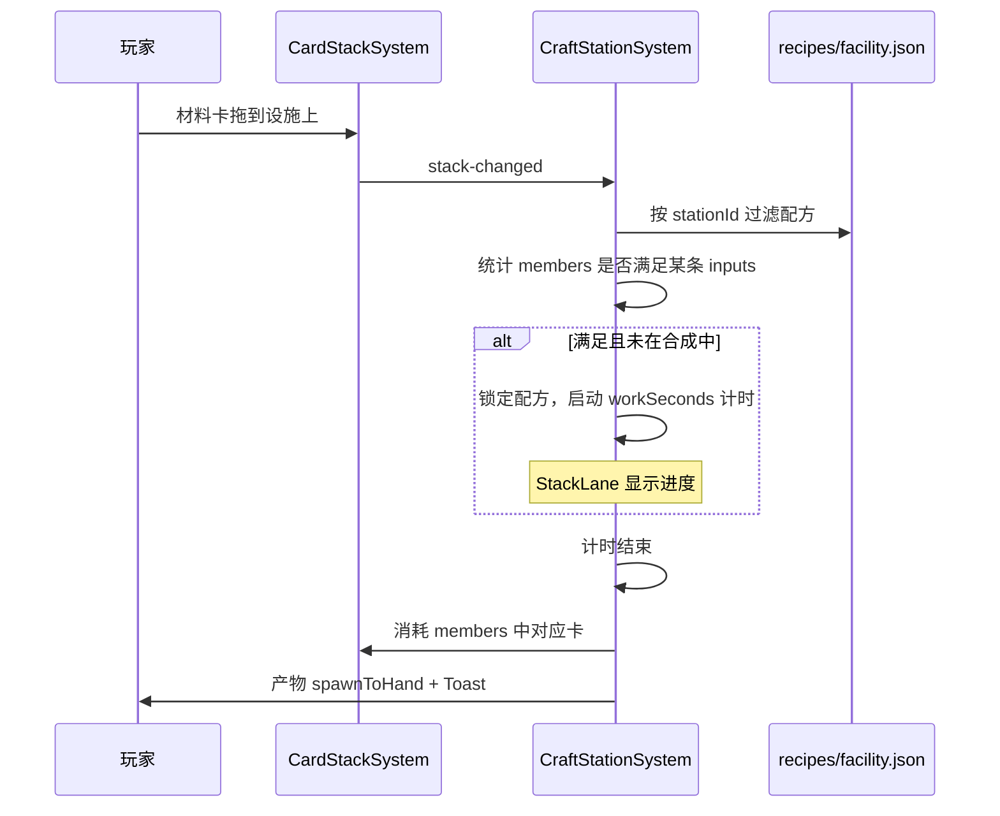

# 设施卡牌 · 叠牌合成设计

> 工房（材料加工）/ 设计院（设施蓝图）  
> 代码目标：`CraftStationSystem`、`craft_station` 效果模块  
> 配置：`deck_facility.json`、`recipes/facility.json`

---

## 核心规则（修订）

| 项 | 规则 |
|----|------|
| **操作** | 将材料/中间卡 **拖入并叠在** 对应设施卡牌上 |
| **幸存者** | **不参与** 设施合成；劳作点（灌木/废料堆/野外块）仍需要幸存者叠放 |
| **设施底牌** | 合成过程中 **不消耗** 设施本身 |
| **输入消耗** | 配方匹配成功后，从堆内 **member** 扣除对应材料卡 |
| **产出** | 完成计时后，产物进入 **手牌** |

与现有 `DefenseCraftSystem`（零件修本营、铁丝网加固栅栏）同一交互范式：**拖入 → 叠牌 → 触发效果**。

---

## 叠放结构

```
┌─────────────────┐
│  材料 B（member）│  ← 后拖入的在上方
├─────────────────┤
│  材料 A（member）│
├─────────────────┤
│  工房 / 设计院   │  ← 底牌（craft_station），固定在场
└─────────────────┘
```

- 底牌必须是带 `craft_station` 效果的设施卡。
- 仅 **members** 参与配方计数；底牌设施 never 计入 inputs。
- 允许一次拖入多张同类材料（多次拖放或手牌连续拖入均可）。

---

## 设施卡牌

> 完整设施 / 材料 / 植物扩展见 [card-expansion-design.md](card-expansion-design.md)

| id | 名称 | shape | stationId | 职责 |
|----|------|-------|-----------|------|
| `facility_workshop` | 锈蚀工房 | tile | `workshop` | 木/纤维/土/化学通用加工 |
| `facility_smelter` | 废土冶炼台 | tile | `smelter` | 金属：铁锭、铁丝、燃料 |
| `facility_kitchen` | 拼凑厨房 | tile | `kitchen` | 食物、盐、口粮 |
| `facility_greenhouse` | 玻璃温室 | tile | `greenhouse` | 种子、肥料、菌类 |
| `facility_well` | 渗滤井 | tile | `well` | 浑水 → 净水 |
| `facility_design_bureau` | 废土设计院 | tile | `design_bureau` | 防御 / 场地 / 其他设施 |

```json
{
  "id": "facility_workshop",
  "name": "锈蚀工房",
  "deck": "facility",
  "shape": "tile",
  "tags": ["building", "craft_station", "facility"],
  "effects": [{ "type": "craft_station", "stationId": "workshop" }]
}
```

---

## 合成流程



### 配方匹配

1. `stack.base` 含 `craft_station` → 读取 `stationId`。
2. 在 `DataStore.getRecipes()` 中筛选 `recipe.stationId === stationId`。
3. 统计堆内 members 的 `cardId` / `tag` 是否满足某条 `inputs`（**不含幸存者**）。
4. 多条可匹配时：**优先 workSeconds 最短**；第二期可加「拖入顺序 / 选择面板」。
5. 输入满足 → 启动 `workSeconds` 倒计时；不足 → 空闲，仅显示预览提示。

### 与劳作点区分

| 底牌标签 | 需要幸存者 | 系统 | 行为 |
|----------|------------|------|------|
| `worksite` | 是 | `WorkSiteSystem` | 周期产出，不消耗材料 |
| `craft_station` | **否** | `CraftStationSystem` | 消耗叠放材料，一次性产出 |

---

## 叠放合法性（CardStackSystem 扩展）

在现有 `resource + building` 规则上收紧为 **仅 craft_station 可收材料**：

| 拖入卡 tags | 目标底牌 tags | 允许 |
|-------------|---------------|------|
| `material` / `resource` / `water_raw` / `food` | `craft_station` | ✓ |
| `survivor` | `craft_station` | ✗ |
| `resource` | `building`（非 craft_station，如大本营） | ✗（去掉泛化 building 收资源，防误叠） |
| `blueprint`（可选二期） | `craft_station` + design_bureau | ✓ |

`stackOutcomePreview` 示例：

- 零件×1 拖入工房，还缺 1 零件 → `「还差：零件 ×1 → 木板」`
- 零件×2 + 拖入工房 → `「合成：木板（8s）」`

---

## 配方表（无幸存者）

### 工房 `stationId: "workshop"`

| id | 输入 | 产出 | workSeconds |
|----|------|------|-------------|
| `recipe_plank_from_scrap` | 零件×2 | 木板×1 | 8 |
| `recipe_scrap_refine` | 浑水×1 + 零件×1 | 零件×2 | 10 |
| `recipe_water_clean` | 浑水×2 | 净水×1 | 12 |
| `recipe_feed_bag` | 变异浆果×2 + 零件×1 | 饲料袋×1 | 10 |
| `recipe_soil_pack` | 土块×2 + 浑水×1 | 土块×3 | 14 |

### 设计院 `stationId: "design_bureau"`

| id | 输入 | 产出 | workSeconds | 备注 |
|----|------|------|-------------|------|
| `recipe_fence_iron` | 零件×2 + 木板×1 | 铁栅栏×1 | 10 | |
| `recipe_barricade_wood` | 木板×2 + 零件×1 | 木板路障×1 | 8 | |
| `recipe_sandbag_wall` | 零件×3 + 木板×2 | 沙袋墙×1 | 14 | |
| `recipe_blight_plot_scrap` | 零件×2 | 污壤×1 | 6 | 由原 recipe_blight_plot 去掉幸存者 |
| `recipe_blight_plot_soil` | 土块×3 | 污壤×1 | 8 | 去掉幸存者 |
| `recipe_spike_strip` | 零件×2 + 木板×2 | 地刺带×1 | 12 | moonPhaseMin: 3 |
| `recipe_chicken_coop` | 木板×3 + 零件×2 + 饲料袋×1 | 鸡舍×1 | 16 | moonPhaseMin: 5 |
| `recipe_facility_workshop` | 零件×4 + 木板×2 | 工房×1 | 20 | 设计院造工房 |

`starter.json` 中带 `tag: survivor` 的旧配方 **不迁入** 设施线；污壤改为上表两条纯材料配方。

---

## 配置示例

```json
{
  "recipes": [
    {
      "id": "recipe_fence_iron",
      "stationId": "design_bureau",
      "category": "facility",
      "inputs": [
        { "cardId": "scrap", "count": 2 },
        { "cardId": "wood_plank", "count": 1 }
      ],
      "output": { "cardId": "fence_iron", "count": 1 },
      "workSeconds": 10
    }
  ]
}
```

`RecipeDefinition` 扩展字段：`stationId`、`category`、`moonPhaseMin`（可选）。

---

## 获取与稀缺

| 来源 | 说明 |
|------|------|
| 商店 | 工房 6 筹码 / 设计院 8 筹码 |
| 设计院合成 | 唯一造工房路径（上表最后一条） |
| 掉落 | 月相 ≥4 低概率蓝图卡（二期） |
| 开局 | 不默认摆放；教程关可送 1 工房 |

设计院 **不能** 自造设计院（防递归）。

---

## 实现分期

### Phase A

- `deck_facility.json` + 2 设施卡
- `recipes/facility.json`（上表全部，无 survivor inputs）
- `CraftStationSystem`：stack-changed → 匹配 → 计时 → 消耗 members → 产出
- `CardStackSystem`：材料 → `craft_station`；禁止 survivor → `craft_station`
- `stackOutcomePreview`：缺料 / 将合成提示

### Phase B

- 商店 listings、`moonPhaseMin` 解锁
- `StackLane` 合成进度条

### Phase C

- 多配方选择 UI、设施 AI 资产 + prompt sidecar

---

## 影响文件

| 路径 | 改动 |
|------|------|
| `docs/facility-craft-design.md` | 本文 |
| `web/public/data/cards/deck_facility.json` | 新增 |
| `web/public/data/recipes/facility.json` | 新增 |
| `web/public/data/cards/manifest.json` | 修改 |
| `web/public/data/decks/catalog.json` | 新增 facility 卡组 |
| `web/src/types/gameData.ts` | CardDeck + Recipe 字段 |
| `web/src/systems/CraftStationSystem.ts` | 新增 |
| `web/src/systems/CardStackSystem.ts` | 叠放规则 |
| `web/src/core/stackOutcomePreview.ts` | 配方预览 |
| `web/src/scenes/GameScene.ts` | 注册系统 |
| `web/src/scenes/PreloaderScene.ts` | 加载 JSON |

---

## 玩家操作速查

1. 把 **工房 / 设计院** 摆在大本营旁（tile 占地）。
2. 从手牌 **拖材料卡到设施上**，叠成一堆。
3. 材料凑够配方 → 自动开始倒计时 → 材料消失，产物进手牌。
4. **幸存者不用参与**；采料仍去灌木 / 野外块叠幸存者。
