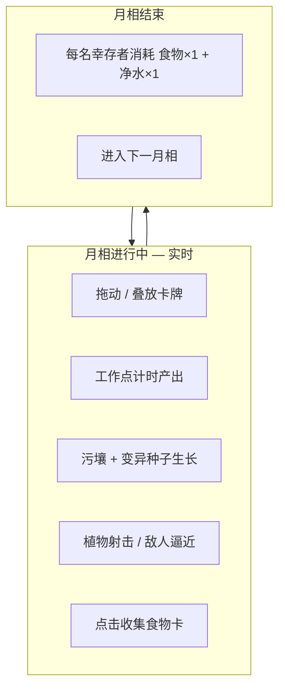

# 《荒原叠卡》— 当前实现与玩法说明

> 版本：网页 MVP `v0.1` · 更新于工程现状  
> 关联文档：[卡组设计](card-decks-design.md) · [入侵/攻击/防御方案](invasion-attack-defense.md) · [美术风格](art-style-prompt.md)

---

## 1. 游戏概述

**荒原叠卡**是一款参考 [Stacklands](https://store.steampowered.com/app/1948280/Stacklands/) 的废土生存卡牌游戏：

- 在自由桌面上 **拖动、叠放** 卡牌；
- 用 **月相** 作为时间节拍，维持食物与净水；
- 工作点产出资源、污壤培育攻击植物、抵御周期性入侵；
- 卡牌数据 **JSON 配置驱动**，效果走可扩展模块，业务代码不写死 `cardId`。

**世界观**：文明崩塌后的荒野，资源稀缺、拼装避难所、轻度变异生物。视觉规范见 `docs/art-style-prompt.md`（低饱和、废土手绘、顶视卡牌）。

**当前形态**：浏览器可玩（手机竖屏适配），非 App Store 包；本地或局域网访问即可。

---

## 2. 技术栈与运行

| 项目 | 说明 |
|------|------|
| 引擎 | Phaser 4（`phaser@beta`） |
| 语言 | TypeScript |
| 构建 | Vite 6 |
| 工程目录 | `web/` |

```bash
cd web
npm install
npm run dev      # 开发：http://localhost:5173
npm run build    # 产出 dist/ 静态资源
npm run preview -- --host   # 手机同 WiFi 访问 Network 地址
```

**移动端**：`index.html` 禁止页面缩放；画布 **`RESIZE` 模式**随 `#game-container` / 窗口尺寸自适应（最小 320×480）；可「添加到主屏幕」当 Web App 使用。

---

## 3. 核心玩法循环



| 阶段 | 玩家做什么 | 系统做什么 |
|------|------------|------------|
| **进行中** | 叠幸存者到灌木/废料堆、种子到污壤、布置栅栏与植物 | 计时产出、生长检定、刷怪、防御射击 |
| **月相结束** | 查看顶栏资源是否够 | 按幸存者数量扣食物/净水；不足时 Toast 警告（尚未 Game Over） |

默认 **月相时长 120 秒**（`BootScene` 写入 `registry`，键 `moonSeconds`）。顶栏初始资源：**食物 4、净水 3、筹码 2**。

---

## 4. 操作说明

| 操作 | 行为 |
|------|------|
| **单指拖动** | 移动卡牌；拖动顶层卡时只动该张，拖动基底可带动整摞（见下） |
| **叠放** | 拖到另一张卡上松开，若规则允许则垂直叠成一堆 |
| **双击同一摞** | 整摞一起拖动（Toast：「整摞拖动」） |
| **点击食物卡** | 单独放在场上的 `food` 标签卡（如变异浆果）→ 收入顶栏食物 +1，卡消失 |

无效叠放时卡牌落回原位或保持独立堆。

---

## 5. 叠放规则（已实现）

由 `CardStackSystem.isValidStackTarget` 判定，**优先标签规则**，否则两卡中心距离 < `STACK_HIT_RADIUS`（56px）也可叠。

| 拖动的卡 | 目标基底标签 | 结果 |
|----------|--------------|------|
| `survivor` | `worksite` | 允许（工作） |
| `mutant_seed` | `blight_plot` | 允许（种植） |
| `resource` | `building` | 允许 |
| `weapon` | 堆中含 `survivor` | 允许（装备） |
| 其他 | 距离足够近 | 允许（通用叠放） |

叠放后成员向上偏移，间距由基底卡 `shape` 的 `stackSnap` 决定。

---

## 6. 已实现系统

### 6.1 工作点产出 — `WorkSiteSystem`

- **触发**：堆中存在 `requiresStackTag`（默认 `survivor`）且基底卡带 `spawn_timer` 效果。
- **配置示例**（`rust_bush`）：每 **8 秒** 在堆旁生成 `berry_mutant`；`scrap_pile` 每 **10 秒** 生成 `scrap`。
- **停止**：幸存者离开堆后定时器移除。

### 6.2 资源收集 — `ResourcePickupSystem`

- 场上 **带 `food` 标签** 的独立卡，**点击**（非拖动）→ 顶栏食物 +1，销毁该卡。
- 净水、筹码等 **尚未** 实现点击收集（仅配置中存在卡）。

### 6.3 变异种植 — `MutantGrowthSystem`

- **条件**：`mutant_seed` 叠在 `blight_plot`（污壤）上。
- **过程**：显示生长进度条，默认 **12 秒**（`plant_mutant.growthSeconds`）。
- **结果**（`data/growth/mutant_outcomes.json` 权重表 `growth_thornvine`）：

| 结果 | 权重 | 效果 |
|------|------|------|
| `plant_thornvine` 锈刺藤 | 70% | 在污壤旁生成攻击植物 |
| `plant_weed` 杂草 | 20% | 生成杂草卡 |
| `fail_contaminate` | 10% | Toast「污壤污染」，无植物 |

### 6.4 入侵 — `InvasionSystem`

- **约 18 秒** 后首次生成 **变异犬**（`mutant_hound`），之后每 **28 秒** 尝试刷新，场上最多 **3** 只。
- 敌人从屏幕边缘生成，朝最近 **幸存者** 移动（速度 42px/s）。
- 贴身（≤36px）每 **2.5 秒** 触发一次袭击 → **食物 -1**（Toast 提示）。

### 6.5 攻击植物 — `DefenseTurretSystem`

- 带 `defense_turret` 效果的植物（如 `plant_thornvine`、`plant_sporegun`）自动攻击射程内敌人。
- 当前配置示例：

| 卡 | 伤害 | 射程 | 耐久 | 冷却 |
|----|------|------|------|------|
| 锈刺藤 | 2 | 90 | 8 | 1.2s |
| 孢子弹匣菇 | 3 | 120 | 5 | 1.5s |

- 敌人 HP 归零后销毁；**植物耐久 / 植物被摧毁** 尚未做完整反馈 UI。

### 6.6 月相与 HUD

- **ResourceBar**：食物、净水、筹码（数字展示）。
- **MoonHud**：当前月相序号 + 倒计时。
- **结算**：每名 `survivor` 消耗食物 1、净水 1；不足时仅警告，**不会结束游戏**。

### 6.7 开局场面

`GameScene.spawnStarterBoard` 固定放置：

| 卡 | 用途提示 |
|----|----------|
| 幸存者 | 去叠灌木/废料堆 |
| 锈蚀灌木、废料堆 | 工作点 |
| 污壤 + 变异种子·刺藤 | 种植线 |
| 铁栅栏、沙袋墙 | 展示 **slim / wide** 牌形 |
| 筹码 | 展示 compact 资源 |

---

## 7. 卡组与牌形（配置已录入，部分玩法未接）

共 **32 张**，分三套 JSON（详见 [card-decks-design.md](card-decks-design.md)）：

| 卡组文件 | 主题 | 张数 |
|----------|------|------|
| `deck_resource.json` | 资源、工作点、材料 | 12 |
| `deck_attack.json` | 武器、种子、植物、敌人 | 10 |
| `deck_defense.json` | 栅栏、掩体、场地 | 10 |

**牌形 `shape`** 决定画面与碰撞盒（`cardLayout.ts` + `GameCard.ts`）：

| shape | 尺寸 (宽×高) | 示例 |
|-------|----------------|------|
| `standard` | 72×90 | 幸存者、变异犬 |
| `compact` | 60×68 | 浆果、筹码、种子 |
| `slim` | 44×118 | **铁栅栏**、木板路障、锈刺藤 |
| `wide` | 108×56 | **沙袋墙**、鸡舍、地刺带 |
| `tile` | 88×88 | 污壤、铁皮掩体 |

卡框纹理按 shape 分五种 procedural shell（`TextureGenerator`）。

---

## 8. 效果模块

### 8.1 已接入（由独立 System 处理）

| 模块 type | 处理方 | 说明 |
|-----------|--------|------|
| `spawn_timer` | `WorkSiteSystem` | 叠卡工作后周期产卡 |
| `plant_mutant` | `MutantGrowthSystem` | 污壤种植生长 |
| `defense_turret` | `DefenseTurretSystem` | 植物自动射击 |

### 8.2 仅在 JSON 中预留（**未实现逻辑**）

| 模块 type | 配置位置示例 |
|-----------|----------------|
| `barrier` | `fence_iron`、`barricade_wood`、`sandbag_wall` |
| `trap_contact` | `spike_strip` |
| `log` | `EffectRunner` 仅打控制台 |

`EffectRunner` 为统一入口，新效果应新增模块 + System，**禁止**在场景里 `if (cardId === 'xxx')`。

---

## 9. 配方与卡包

- **配方**：`public/data/recipes/starter.json` 已定义 2 条，**配方匹配 / 制作 UI 尚未实现**。
- **卡包**：`data/decks/catalog.json` 与 `card-decks-design.md` 中规划了 `pack_resource` 等，**抽包 / 商店未实现**。
- **筹码**：顶栏展示，**购买卡包消耗未接**。

---

## 10. 数据架构

```
web/public/data/
  cards/
    deck_resource.json
    deck_attack.json
    deck_defense.json
    manifest.json          # 文件列表（参考）
    starter.json           # 旧版，已被三套 deck 取代
  decks/catalog.json       # 卡组元信息
  growth/mutant_outcomes.json
  recipes/starter.json
```

加载流程：

1. `PreloaderScene` 加载 JSON + 可选 `assets/cards/{artKey}.png`
2. `collectCardsFromCache` 合并三套 deck → `DataStore`
3. `generateGameTextures` 按卡 id 生成 procedural 图标与牌框
4. `GameScene` 启动玩法系统

**卡牌字段**（`types/gameData.ts`）：

| 字段 | 说明 |
|------|------|
| `id` / `name` | 唯一 id、显示名 |
| `deck` | `resource` \| `attack` \| `defense` |
| `shape` | 牌形尺寸预设 |
| `tags` | 叠放与逻辑筛选 |
| `color` | 卡面底色 |
| `effects` | 效果模块数组 |
| `artKey` | 可选 PNG（`public/assets/cards/`） |

---

## 11. 代码架构

```
web/src/
  main.ts                 # Phaser 启动、禁右键/手势缩放
  config/
    gameConfig.ts         # 分辨率、场景列表、月相 registry
    cardLayout.ts         # 牌形尺寸表
  scenes/
    BootScene.ts          # 初始化月相 120s
    PreloaderScene.ts     # 加载数据与纹理
    GameScene.ts          # 主玩法编排
  objects/
    GameCard.ts           # 卡牌视觉（shape 自适应）
  systems/
    CardDragSystem.ts     # 触摸拖动、双击整摞
    CardStackSystem.ts    # 叠放规则与布局
    WorkSiteSystem.ts
    MutantGrowthSystem.ts
    InvasionSystem.ts
    DefenseTurretSystem.ts
    ResourcePickupSystem.ts
  core/
    DataStore.ts          # 卡表 / 配方只读缓存
    CardSpawner.ts        # 统一生成场上卡
    EffectRunner.ts       # 效果分派（扩展点）
    loadCards.ts          # 合并 deck JSON
  ui/
    GameBackground.ts     # 场景背景图（cover 铺满）+ 牌桌遮罩；缺图时程序化兜底
    MoonHud.ts
    ResourceBar.ts
  art/
    TextureGenerator.ts   # 无 PNG 时的占位图
```

**场景流**：`Boot` → `Preloader` → `Game`

**事件总线**（`GameScene` / `scene.events`）示例：`stack-changed`、`moon-end`、`card-spawned`、`mutant-growth-complete`、`invasion-spawn`、`enemy-reached-survivor`。

---

## 12. 与 Stacklands 的对照

| Stacklands | 本作现状 |
|------------|----------|
| 叠卡生产 | ✅ 幸存者 + 工作点 |
| 月相末进食 | ✅ 食物 + 净水双资源 |
| 卖卡买包 | ⏳ 筹码仅显示 |
| Idea 配方发现 | ⏳ 配方 JSON 未接 UI |
| 敌人靠近战斗 | ✅ 变异犬移动 + 植物射击 |
| 卡牌尺寸一致 | ✅ 已按 shape 区分（栅栏细长等） |

---

## 13. 已知限制与后续

| 项目 | 状态 |
|------|------|
| 配方制作 | 未做 |
| 卡包 / 商店 | 未做 |
| 栅栏 `barrier`、地刺 `trap_contact`、掩体 `shelter` | ✅ |
| 本营修复（叠零件）、月相回血 | ✅ |
| 入侵波次 `waves.json` | ✅ |
| 净水点击收集、净化浑水 | 未做 |
| 月相不足 Game Over | 仅 Toast |
| 胜利 / 目标天数 | 未做 |
| 存档 | 未做 |
| AI 卡图 | 使用 procedural 占位，可换 `artKey` PNG |

建议迭代顺序：**配方匹配 → 筹码买包 → 栅栏挡怪 → 胜负条件**。

---

## 14. 相关文件索引

| 文档 / 路径 | 内容 |
|-------------|------|
| `docs/game-implementation.md` | 本文 |
| `docs/invasion-attack-defense.md` | 入侵·攻击·防御系统设计 |
| `docs/card-decks-design.md` | 32 张卡明细与牌形规范 |
| `docs/art-style-prompt.md` | AI 出图与 sidecar 规范 |
| `web/public/data/cards/*.json` | 卡牌数据 |
| `.cursor/rules/card-survival-game.mdc` | 项目开发约束（配置化、效果模块） |

---

## 15. 快速试玩清单

1. `npm run dev`，浏览器打开本地地址。  
2. 把 **幸存者** 拖到 **锈蚀灌木** 上，等待 **变异浆果** 掉落。  
3. **点击** 浆果，看顶栏食物增加。  
4. 把 **变异种子·刺藤** 拖到 **污壤** 上，等生长，获得 **锈刺藤**。  
5. 等 **变异犬** 出现，观察刺藤自动射击（需刺藤在射程内）。  
6. 等待月相结束，确认食物/净水扣除。  
7. 对比 **铁栅栏（细长）** 与 **沙袋墙（横条）** 的外形差异。
