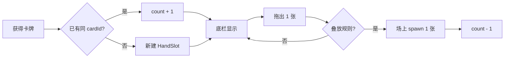

# 游戏界面布局设计方案

> 状态：**已实现**（MVP）  
> 关联：[当前实现说明](game-implementation.md) · [大本营规则](base-camp-design.md) · [卡组设计](card-decks-design.md)  
> 现状参考：`GameScene` 全屏牌桌 + `ResourceBar` / `MoonHud` 顶栏两条

---

## 1. 设计目标

| 目标 | 说明 |
|------|------|
| **信息一眼可读** | 资源、月相、本营耐久集中在顶部，不遮挡主牌桌 |
| **获得 → 放置有节奏** | 新卡先进底部「待放置区」，玩家再拖到场上，减少满屏乱卡 |
| **叠放过程可感知** | 左侧竖向叠牌区展示「进行中」的堆与效果，与中央自由桌面分工 |
| **竖屏友好** | 与现有 `RESIZE`、安全区兼容；底栏 **无张数上限**，种类多时左右滑动 |

---

## 2. 屏幕分区（总览）

```
┌─────────────────────────────────────────────┐
│  TOP BAR — 资源 / 月相 / 本营 / 快捷提示      │  ← 固定 HUD，depth 最高
├──────┬──────────────────────────────────────┤
│      │                                      │
│ 左   │         PLAYFIELD 主牌桌              │
│ 侧   │    （大本营、防线、工作点、敌人等）       │
│ 叠   │                                      │
│ 牌   │                                      │
│ 效   │                                      │
│ 果   │                                      │
│ 栏   │                                      │
│      │                                      │
├──────┴──────────────────────────────────────┤
│  HAND BAR — 玩家待放置卡牌（新卡入栏）          │  ← 固定底栏，可横滑
└─────────────────────────────────────────────┘
```

**深度约定（自低到高）**：背景 → 主牌桌卡牌 → 左侧叠牌预览 → 拖动手牌/场上卡 → TOP/HAND 面板 → Toast / Game Over。

---

## 3. 顶部 Top Bar

### 3.1 与现状关系

当前已有：

- `ResourceBar`：食物 / 净水 / 筹码 + 可选本营耐久（单行文字）
- `MoonHud`：月相序号 + 倒计时

**方案**：合并为一条 **TopHud**（视觉上一条底条，内部分区），避免两条横条占过多竖屏高度。

### 3.2 分区布局（建议）

| 区域 | 内容 | 交互 |
|------|------|------|
| **左：资源** | 食物、净水、筹码（图标 + 数字）；后续可扩展零件、饲料等 | 点击可展开简要说明（可选）；月相结算不足时数字闪红 |
| **中：月相** | `月相 N` + 倒计时 `M:SS` + 细进度条 | 仅展示；月相结束时可短动画 |
| **右：本营** | `本营 hp/max` + 细血条（与牌面底条一致语义） | 点击镜头轻移聚焦本营（可选） |

### 3.3 尺寸与安全区

| 项 | 建议值 |
|----|--------|
| 总高度 | 56–64 px（合并后比现两条略省高约 20px） |
| 宽度 | `min(400, screenWidth - 24)`，与现 `hudBarWidth` 一致 |
| 垂直位置 | `safeTop + 32`（沿用 `getSafeTop()`） |
| 样式 | 废土色 `#2a2620` 半透明底 + `#5c4a32` 描边，与 `MoonHud` 统一 |

### 3.4 数据绑定

| 显示项 | 数据源 |
|--------|--------|
| 食物 / 净水 / 筹码 | `GameScene.resources`（现逻辑） |
| 本营 | `BaseCampSystem` → `base-hp-changed` |
| 月相 | `registry` `MOON_INDEX` / `MOON_SECONDS` + `MoonHud` 计时 |

### 3.5 顶栏不放的项

- **Toast / 入侵警告**：仍用场景中部偏下浮动字，避免顶栏过载。
- **单张资源卡详情**：属于卡牌交互，不进顶栏。

---

## 4. 底部玩家卡牌栏（Hand Bar）

### 4.1 定位

**待放置区（Hand）**：玩家已「拥有」但尚未摆到主牌桌上的卡。  
参考 Stacklands 的「手牌/牌堆」节奏：先入手，再拖到桌面参与叠放与生产。

### 4.2 入栏规则

| 来源 | 现行为 | 改后行为 |
|------|--------|----------|
| 工作点 `spawn_timer` 产出 | `CardSpawner.spawn` 在堆旁坐标生成 | **默认进入 Hand**（按 `cardId` 合并数量，见 §4.3） |
| 开局 `spawnStarterBoard` | 直接摆在场上固定坐标 | **不变**（教学/开局布局仍一次性摆好） |
| 未来：开卡包 / 配方奖励 | — | 一律进 Hand |
| 点击收集食物 | 顶栏 +1，卡销毁 | **不变**（不经过 Hand） |
| 入侵刷怪 | 场上生成敌人 | **不进 Hand** |

### 4.3 栏内表现

| 项 | 说明 |
|----|------|
| **种类上限** | **无上限**；逻辑上可持有任意多张待放置卡 |
| **同类合并** | 相同 `cardId` **只占一格**：只显示一张缩略图，**右上角数量角标** 表示持有张数（见下） |
| 排列 | 横向一排，每种卡一个槽位（`HandSlot`）；**新种类**出现在最右侧；**已有种类**仅 `count + 1`，槽位可保持在原位置或轻移到最右（实现二选一，默认 **原位叠数**） |
| 单卡尺寸 | 使用 `compact` 缩略（约 52×58），比场上 `standard` 略小 |
| 角标 | 槽位右上角圆形/胶囊底 + 数字（如 `×12` 或 `12`）；`count > 1` 时显示；`count === 1` 时可不显示角标（仅一张图） |
| 滚动 | 槽位总宽度超过可视区时，底栏 **始终支持左右滑动**（触屏横滑；仅 Hand 区域消费手势，不与主牌桌拖动冲突） |
| 空栏 | 无任何槽位时显示淡色占位（可选） |

#### 4.3.1 数据模型（HandInventory）

按 **`cardId` 聚合**，不是「每张物理卡一行」：

```ts
interface HandSlot {
  cardId: string;   // 对应 CardDefinition.id
  count: number;    // 持有张数，≥ 1
  order: number;    // 用于排序：首次入栏时间或最近 +1 时间（实现定一种）
}
```

| 操作 | 数据变化 |
|------|----------|
| 获得 `berry_mutant` ×1 | 已有槽 → `count++`；无槽 → 新建 `HandSlot`，`count = 1` |
| 拖到场上成功放置 ×1 | 对应槽 `count--`；`count === 0` 时移除该槽 |
| 无效放置 | `count` 不变 |

**合并键**：默认仅 `cardId`（同名即合并）。若未来存在「同 id 不同状态」卡，再扩展为 `cardId + variantKey`。

#### 4.3.2 角标视觉（示意）

```
┌─────────┐
│      ┌──┐
│ 图标 │12│  ← 右上角数量（count > 1）
│      └──┘
│ 浆果   │
└─────────┘
```

| 项 | 建议 |
|----|------|
| 角标位置 | 槽位容器右上，内边距 2–4 px，压在卡图之上（depth 高于缩略图） |
| 字号 | 10–11px，浅色字 + 深色描边或 `#3a3028` 底 |
| 极大数量 | `count > 99` 显示 `99+` |

### 4.4 放置交互



| 操作 | 行为 |
|------|------|
| **从 Hand 拖出** | 按下某槽位 → 跟手移动（角标可临时隐藏或跟拖 shadow 显示「拖 1 张」）→ 在 `PLAYFIELD` 内松手且规则通过 → 场上生成 **1** 张正式 `GameCard`；该槽 `count -= 1` |
| **拖回 Hand** | 场上独立单卡拖回底栏 → 对应 `cardId` 槽 `count++`（无槽则新建）（可选二期） |
| **与场上叠放** | 松手时仍走 `CardStackSystem.isValidStackTarget` |
| **双击** | Hand 内不适用「整摞拖动」；场上规则保留 |
| **滑动 vs 拖动** | 横向位移小且快 → 滚动底栏；按下槽位并移出阈值 → 进入拖放（避免误滑） |

**坐标系**：Hand 槽位为 **UI 容器** 内图标；放置时 `CardSpawner.spawn(cardId, x, y)` 新建场上实例，**不**与角标共用同一 `GameCard`。

### 4.5 边界情况

| 情况 | 处理 |
|------|------|
| 同类大量堆积（如 50+ 浆果） | 仍单槽 + 角标数字；底栏 **横滑** 浏览，无「手牌已满」 |
| 拖放中月相结束 | 扣资源照常；Hand 数量不自动变化 |
| 游戏结束 | Hand 锁定不可拖出 |
| 滚动条 | 槽位很多时可加底缘细滚动条或边缘渐隐暗示（可选） |

### 4.6 尺寸

| 项 | 建议值 |
|----|--------|
| 栏高度 | 72–88 px（含内边距） |
| 底边距 | `safeBottom + 8`（若未来支持 home indicator，与顶栏对称） |
| 主牌桌可用高度 | `screenHeight - topHud - handBar - 左侧栏宽度` |

---

## 5. 左侧叠牌效果栏（Stack Lane）

### 5.1 定位

**不是第二张主牌桌**，而是：

1. **进行中堆的竖向缩略**（工作点 + 幸存者、种子 + 污壤生长等）  
2. **效果可读性**：计时、产出图标、生长进度在窄栏内可见  
3. **快捷定位**：点击缩略跳转到场上对应堆（相机平移或高亮边框）

与 Stacklands 区别：本作已有中央自由桌面；左栏是 **HUD 化的堆监视器**，减少玩家在全屏找小进度条。

### 5.2 显示哪些堆

| 类型 | 入选条件 | 栏内展示 |
|------|----------|----------|
| 工作点堆 | 基底 `worksite` 且存在 `spawn_timer` | 基底 + 顶层幸存者缩略图；底部小计时弧 |
| 生长堆 | `mutant_seed` 在 `blight_plot` 上 | 种子/污壤叠放预览 + `MutantGrowthSystem` 进度 |
| 防御/攻击植物 | 可选二期 | 植物图标 + 射程示意点 |
| 通用叠放 | **默认不显示** | 仅规则相关的「效果堆」入库，避免左栏刷屏 |

**数量**：同时最多显示 **4–6** 摞；超出时最旧的折叠为「+N」或按优先级（生长 > 工作 > 其他）。

### 5.3 视觉：叠牌效果

```
  ┌───┐
  │ 顶 │  ← 成员卡（偏移 4–6px 露出边缘）
  ├───┤
  │ 中 │
  ├───┤
  │基底│  ← worksite / blight_plot
  └───┘
   ◔ 8s   ← 产出/生长倒计时
```

| 项 | 说明 |
|----|------|
| 宽度 | 56–72 px（单卡宽度的 0.9–1.0） |
| 高度 | 与主牌桌同高（夹在 Top 与 Hand 之间） |
| 叠放偏移 | 沿用 `stackSnap` 比例缩小（如 0.35×） |
| 动效 | 产出完成时栏内闪一下 + 新卡飞入底部 Hand（可选粒子） |

### 5.4 与系统关系

| 系统 | 关系 |
|------|------|
| `CardStackSystem` | 左栏订阅 `stack-changed` / 定时刷新，只读映射 `getAllStacks()` 中符合标签的堆 |
| `WorkSiteSystem` | 计时状态通过堆 id 关联 |
| `MutantGrowthSystem` | 生长进度条在缩略堆上绘制 |
| `CardDragSystem` | **不在左栏内拖动**（避免与主桌两套命中）；仅点击聚焦 |

### 5.5 空状态

左栏无符合条件堆时：显示竖排淡图标 +「进行中的叠放会显示在这里」，不占交互。

---

## 6. 主牌桌（Playfield）调整

在引入三栏后，主牌桌为 **中间矩形裁剪区**（逻辑边界，非必须物理遮罩）：

| 项 | 说明 |
|----|------|
| 水平范围 | `x ∈ [leftLaneWidth, width]` |
| 垂直范围 | `y ∈ [topHudBottom, height - handBarHeight]` |
| 开局布局 | `spawnStarterBoard` 坐标改为相对 **playfield 中心** 计算，而非整屏中心 |
| 敌人路径 | `InvasionSystem` 刷怪边仍用 playfield 外缘或全屏外缘（实现时二选一，建议全屏外缘保持压迫感） |
| 本营 | 保持在 playfield 几何中心偏上（与 `base-camp-design` 一致） |

**可选**：牌桌暗角 vignette 仅在 playfield 内，强化「桌心」感。

---

## 7. 布局常量（实现期参考）

建议新增 `layoutConfig.ts`（实现阶段）集中管理，便于 `resize`：

```ts
// 示意，非最终实现
interface GameLayoutRects {
  topHud: Phaser.Geom.Rectangle;
  stackLane: Phaser.Geom.Rectangle;
  playfield: Phaser.Geom.Rectangle;
  handBar: Phaser.Geom.Rectangle;
}
```

| 常量 | 表达式（相对屏幕） |
|------|-------------------|
| `TOP_H` | 60 |
| `HAND_H` | 80 |
| `LANE_W` | `clamp(108, width * 0.28, 132)` |
| `playfield` | 见 §6 |

`GameScene.handleResize` 中统一重算并下发 `layout-changed` 事件。

---

## 8. 模块划分（实现顺序建议）

| 阶段 | 内容 | 依赖 |
|------|------|------|
| **P0** | `LayoutManager` 计算四区矩形 + resize | `GameScene` |
| **P1** | `TopHud` 合并 `ResourceBar` + `MoonHud` | P0 |
| **P2** | `HandBar` + `HandInventory` 数据；`CardSpawner` 增加 `spawnToHand` | P1、`CardSpawner` |
| **P3** | 从 Hand 拖到 playfield 的命中与 `CardDragSystem` 扩展 | P2 |
| **P4** | `StackLane` UI 订阅堆与生长/工作计时 | P0、`CardStackSystem` |
| **P5** | 工作点产出改走 Hand；合并槽位 + 横滑与角标动画 | P2–P4 |

**不改业务规则**：叠放判定、月相扣费、入侵仍用现有 System，仅改 **卡牌出生点** 与 **UI 容器**。

---

## 9. 事件扩展（建议）

| 事件 | 时机 |
|------|------|
| `layout-changed` | 窗口 resize，携带各 rect |
| `hand-slot-changed` | 某 `cardId` 的 `count` 变化（含新建/归零移除） |
| `card-placed-from-hand` | 从 Hand 放置 1 张到 playfield |
| `stack-lane-focus` | 点击左栏某堆，请求场景聚焦 |

---

## 10. 待决问题

| # | 问题 | 倾向 |
|---|------|------|
| 1 | 同类 +1 后槽位是否移到最右 | 默认 **原位只改角标**；若需强调新收获可移到最右 |
| 2 | 场上已有卡能否拖回 Hand | 二期再做，避免回收 exploit |
| 3 | 左栏是否允许拖放 | 一期 **只读 + 点击聚焦**，降低 `CardDragSystem` 复杂度 |
| 4 | Hand 与场上是否同一 `GameCard` 实例 | **否**：Hand 为 `HandSlot` 图标 + 数量；放置时 `spawn` 一张，槽位 `count--` |
| 5 | 顶栏是否显示零件/饲料 | 等资源玩法接入后再加槽位 |

---

## 11. 验收标准（实现后）

- [ ] 竖屏 390×844：Top / 左 / 底 / 中 四区不重叠，主牌桌可拖放本营与栅栏  
- [ ] resize 后四区与 Hand 内卡位置正确  
- [ ] 工作点连续产出同种卡：底栏 **只占一格**，角标递增；可 **左右滑动** 查看多种卡  
- [ ] 从底栏拖出 1 张：角标减 1，场上可正常叠放；减至 0 时该格消失  
- [ ] 底栏 **无张数上限**，大量同类时仍可横滑、不 Toast「已满」  
- [ ] 左栏能见到「幸存者+锈蚀灌木」工作堆，计时结束后底栏对应种类 `count + 1`  
- [ ] 顶栏本营耐久与 `base-hp-changed` 同步  
- [ ] 月相结束扣食物/净水时顶栏数字更新且可辨识不足  

---

## 12. 小结

| 区域 | 职责 |
|------|------|
| **Top Bar** | 资源 + 月相 + 本营，统一 HUD |
| **Hand Bar** | 无上限、可横滑；同 `cardId` 合并一格 + 右上角数量；拖出每次 1 张 |
| **Stack Lane** | 左侧竖向叠放缩略 + 进度，监视进行中的效果堆 |
| **Playfield** | 现有叠放、战斗、生产的主舞台，几何范围让位给三栏 |

**实现文件**：`layoutConfig.ts` · `LayoutManager.ts` · `HandInventory.ts` · `TopHud.ts` · `HandBar.ts` · `StackLane.ts` · `GameScene` 编排。
