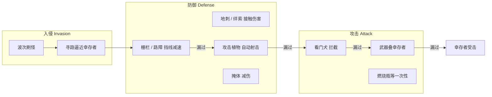

# 入侵 · 攻击 · 防御 — 系统设计

> 废土叠卡生存 · 战斗子系统方案  
> 关联：[实现说明](game-implementation.md) · [卡组](card-decks-design.md)  
> 原则：配置驱动、效果模块化、线性加压、无无限刷怪

---

## 1. 设计目标

| 目标 | 做法 |
|------|------|
| **三层分工清晰** | 入侵（系统施压）→ 防御（阵地消耗）→ 攻击（玩家/单位反击） |
| **叠卡即布阵** | 栅栏挡线、植物射击、武器叠人，与 Stacklands 操作一致 |
| **可读威胁** | 敌人从边缘来、先碰防线再找人；顶栏 + Toast 反馈 |
| **与月相绑定** | 压力随月相升，月末可有大波；白天生产、夜晚更险（可选阶段） |
| **配置可调** | 波次、敌人、效果全在 `data/invasion/`、`cards/*.json` |

---

## 2. 总览：威胁如何解决



**优先级（同帧判定顺序）**：

1. 敌人移动 → 是否与 **barrier / wall** 碰撞（挡路、减速、扣障耐久）  
2. 进入 **attack_plant / trap** 射程或接触 → 受伤  
3. **guard 单位** 在敌人与幸存者之间 → 接战  
4. 贴身幸存者 → 结算 **survivor_hit**（食物/生命惩罚）  
5. 叠了 **weapon** 的幸存者 → 提高近战反击伤害、缩短贴身惩罚间隔  

---

## 3. 入侵（Invasion）

### 3.1 节奏：月相 + 实时

| 机制 | 说明 |
|------|------|
| **基础刷怪** | 月相进行中按 `spawnInterval` 从四边刷怪（**已实现**：首波 18s，周期 28s，上限 3 只） |
| **月相加压** | 第 `n` 月相读取 `waveTier = min(n, maxTier)`，提高血量/数量/种类权重 |
| **月末涌动** | `moon-end` 前 15s 可选触发 `surge`：额外 2～4 只，制造「撑过本月」紧张感 |
| **和平模式** | 配置开关：无刷怪，仅生产（对标 Stacklands Peaceful） |

### 3.2 敌人类型（配置表）

| id | 名称 | 移速 | HP | 贴身伤害 | 特性 |
|----|------|------|-----|----------|------|
| `mutant_hound` | 变异犬 | 42 | 6 | 食物 -1 / 2.5s | 基准怪（**已实装**） |
| `rad_rat` | 辐射鼠 | 58 | 3 | 食物 -1 / 3s | 快、脆，绕远 |
| `scavenger` | 拾荒者 | 32 | 8 | 零件 -1 | 优先朝资源卡移动 |
| `spore_beast` | 孢兽 | 28 | 14 | 净水 -1 | 慢坦克，月相 5+ |
| `alpha_hound` | 头领犬 | 38 | 18 | 食物 -2 | 小 Boss，每 6 月相最多 1 只 |

敌人数据放在 `data/invasion/enemies.json`，**禁止**在 `InvasionSystem` 写死 HP。

### 3.3 波次配置示例

文件：`data/invasion/waves.json`

```json
{
  "maxTier": 12,
  "tiers": [
    {
      "moonMin": 1,
      "moonMax": 3,
      "spawnIntervalSec": 28,
      "maxAlive": 3,
      "pool": [
        { "enemyId": "mutant_hound", "weight": 100 }
      ]
    },
    {
      "moonMin": 4,
      "moonMax": 6,
      "spawnIntervalSec": 24,
      "maxAlive": 4,
      "pool": [
        { "enemyId": "mutant_hound", "weight": 70 },
        { "enemyId": "rad_rat", "weight": 30 }
      ],
      "surgeOnMoonEnd": { "count": 2, "leadSec": 15 }
    }
  ]
}
```

### 3.4 寻路与目标

| 规则 | 说明 |
|------|------|
| 默认目标 | 最近 **survivor** 卡牌中心（**已实现**） |
| 拾荒者 | 最近带 `resource` 且非堆叠保护的卡 |
| 移动 | 直线逼近；遇 **barrier** 沿切线滑动或停住攻击栅栏 |
| 不穿卡 | 敌人不叠在玩家卡上，仅碰撞体积 |

### 3.5 入侵 → 奖励（稀缺）

- 击杀掉落：`scrap` 权重 60、`caps` 20、低概率 `seed_thornvine` 5。  
- 同屏掉落卡 ≤ 5，避免刷屏。

---

## 4. 攻击（Attack）

玩家主动制造的杀伤力，主要来自 **攻击卡组**。

### 4.1 分类

| 类型 | 代表卡 | 机制 | 状态 |
|------|--------|------|------|
| **武器** | 砍刀、弩、燃烧瓶 | 叠在幸存者上，改 `combat` 组件 | 配置有，**逻辑未接** |
| **攻击植物** | 锈刺藤、孢菇 | `defense_turret` 自动射击 | **已实装** |
| **护卫** | 看门犬 | `guard_unit`：移动拦截、近战咬 | 未接 |
| **陷阱** | 绊索 | `trap_contact`：第一次经过受伤 | 未接 |
| **种子** | 变异种子 | 种污壤 → 长成植物 | **已实装** |

### 4.2 武器（叠幸存者）

配置效果：`equip_weapon`

```json
{
  "type": "equip_weapon",
  "damage": 2,
  "range": 40,
  "attackCooldown": 1.8,
  "slot": "melee"
}
```

| 武器 | damage | range | 备注 |
|------|--------|-------|------|
| 生锈砍刀 | 2 | 40 melee | 贴身反击 +2 |
| 废料弩 | 2 | 110 ranged | 优先打最近敌人 |
| 燃烧瓶 | 6 | 60 | 一次性，`consumeOnUse` |

**规则**：幸存者堆顶为 `weapon` 时，在冷却满足且敌人在射程内自动 `damageEnemy`（与植物共用 `InvasionSystem.damageEnemy`）。

### 4.3 攻击植物（阵地火力）

| 卡 | shape | 定位 | DPS 约 |
|----|-------|------|--------|
| 锈刺藤 | slim | 近程、高耐久 | 2 / 1.2s |
| 孢子弹匣菇 | standard | 中程、脆 | 3 / 1.5s |

扩展：第 8 月相解锁 `plant_acid`（附带腐蚀 debuff），配置 `on_hit_apply`。

### 4.4 看门犬（移动攻击）

效果：`guard_unit`

- 不叠在人上时：在基地半径内 **巡逻**（缓慢随机）。  
- 敌人进入 80px：扑向敌人，造成 `damage`，自身可掉 HP。  
- 与植物分工：犬补刀漏网，植物守要点。

### 4.5 陷阱（攻击向）

| 卡 | 触发 | 伤害 | 消耗 |
|----|------|------|------|
| 绊索 slim | 敌人中心进入 50px | 4 | 触发后销毁 |
| 燃烧瓶 | 玩家拖到敌人上松开 | 6 | 消耗卡 |

---

## 5. 防御（Defense）

吸收、迟滞威胁，给攻击层创造输出窗口。

### 5.1 分类

| 类型 | 代表卡 | shape | 机制 |
|------|--------|-------|------|
| **线性障碍** | 铁栅栏、木板路障 | slim | `barrier`：挡路 + 减速 |
| **横向掩体** | 沙袋墙、废铁门 | wide | `barrier` + 可选 `blockRanged` |
| **接触陷阱** | 地刺带 | wide | `trap_contact` |
| **场地** | 污壤、掩体 | tile | 种植 / `shelter` 减伤 |
| **消耗** | 铁丝网卷 | compact | 使用后生成 1 格 `fence_iron` |

### 5.2 障碍 `barrier`（待实现）

```json
{
  "type": "barrier",
  "hp": 12,
  "slow": 0.5,
  "blockRanged": false,
  "width": 44
}
```

| 行为 | 说明 |
|------|------|
| 碰撞 | 敌人进入障碍 AABB → 移速 × `(1 - slow)`，每 0.5s 对障碍造成 1 点伤害 |
| 耐久归零 | 障碍卡变 `barrier_ruined`（compact 废墟）或销毁 |
| slim 栅栏 | 细长碰撞盒，适合 **排成防线**；wide 沙袋墙挡远程（孢兽投掷未来扩展） |

### 5.3 掩体 `shelter`

- 幸存者叠在 `bunker_sheet` 上：贴身伤害 **减半**，每月相限触发 2 次。  
- 不阻挡敌人移动（敌人仍可「围攻」掩体）。

### 5.4 防御 vs 攻击植物

| | 防御（栅栏/墙） | 攻击植物 |
|--|----------------|----------|
| 主要作用 | 迟滞、吃伤害 | 输出伤害 |
| 是否射击 | 否 | 是 |
| 典型牌形 | slim / wide | slim / standard |
| 建造成本 | 木板+零件 | 种子+时间 |

**推荐布阵**：外圈 slim 栅栏 → 内圈植物 → 核心幸存者 + 掩体。

---

## 6. 三层联动数值（线性示例）

以 **月相 1 / 5 / 10** 为基准（单人、1 幸存者）：

| 月相 | 月均入侵只数 | 推荐防线 | 推荐火力 |
|------|--------------|----------|----------|
| 1 | ~4 犬 | 0～1 路障 | 1 灌木产粮即可 |
| 5 | ~8 混合 | 2 slim 栅栏 + 1 刺藤 | 1 武器或 2 植物 |
| 10 | ~12 + surge | 沙袋墙 + 3 植物 | 弩 + 犬 + 陷阱 |

**压力公式（配置，非指数）**：

```
spawnIntervalSec = max(16, 32 - moonIndex * 1.2)
enemyHp          = baseHp + moonIndex * 0.8
maxAlive         = min(6, 2 + floor(moonIndex / 2))
```

---

## 7. 效果模块清单（战斗）

| type | 归属 | 处理 System |
|------|------|-------------|
| `defense_turret` | 攻击植物 | `DefenseTurretSystem` ✅ |
| `barrier` | 防御障碍 | `BarrierSystem` ⏳ |
| `trap_contact` | 攻击/防御 | `TrapSystem` ⏳ |
| `equip_weapon` | 攻击武器 | `CombatEquipSystem` ⏳ |
| `guard_unit` | 攻击护卫 | `GuardSystem` ⏳ |
| `shelter` | 防御掩体 | `ShelterSystem` ⏳ |
| `on_hit_apply` | 攻击 debuff | `StatusSystem` ⏳ |
| `plant_mutant` | 攻击前置 | `MutantGrowthSystem` ✅ |

新增模块只加 JSON + Runner 分支 + System，**禁止** `if (cardId === 'fence_iron')`。

---

## 8. 场景事件流（实现参考）

```
InvasionSystem.tick
  → 对每个敌人：BarrierSystem.resolveMovement (改速度/伤障)
  → TrapSystem.checkContact
  → DefenseTurretSystem + CombatEquipSystem + GuardSystem 攻击
  → 若仍贴身幸存者 → emit survivor_hit

moon-end
  → WaveScheduler.applySurgeIfNeeded
  → 清零临时 debuff
```

---

## 9. UI / 反馈

| 元素 | 内容 |
|------|------|
| 顶栏旁 | 可选「威胁」图标：当前 `enemiesAlive / maxAlive` |
| 卡面 | 障碍/植物 HP 细条（低于 30% 闪红） |
| Toast | 入侵、袭击、栅栏毁坏、击杀掉落 |
| 月相 HUD | 下月相预览：`下波：辐射鼠↑`（读 waves 配置） |

**玩家向完整呈现**（分区、教学、颜色、MVP 清单）见 [player-combat-presentation.md](player-combat-presentation.md)。

---

## 10. 配置目录规划

```
web/public/data/
  invasion/
    enemies.json      # 敌人 stats
    waves.json        # 月相 tier 与池
    drops.json        # 击杀掉落
  cards/
    deck_attack.json
    deck_defense.json
```

---

## 11. 实施分期

| 阶段 | 内容 | 优先级 |
|------|------|--------|
| **P0** | `waves.json` + 月相加压 + 多敌人种类 | 高 |
| **P1** | `BarrierSystem`（栅栏/沙袋挡线） | 高 |
| **P2** | `equip_weapon` + 贴身反击 | 中 |
| **P3** | `trap_contact` / 绊索 / 地刺 | 中 |
| **P4** | `guard_unit` 看门犬 | 中 |
| **P5** | 月末 surge、掩体、shelter | 低 |

**当前代码**：P0 部分（仅 `mutant_hound` 固定刷）、植物射击 ✅；栅栏/武器/犬 ⏳。

---

## 12. 与现有卡牌的对应

### 攻击卡组 → 本方案

| 卡 | 角色 |
|----|------|
| 砍刀 / 弩 / 燃烧瓶 | §4.2 武器 |
| 变异种子 → 植物 | §4.3 |
| 看门犬 | §4.4 |
| 绊索 | §4.5 |
| 变异犬 | §3.2 入侵单位 |

### 防御卡组 → 本方案

| 卡 | 角色 |
|----|------|
| 铁栅栏 / 木板路障 | §5.2 slim barrier |
| 沙袋墙 / 废铁门 | §5.2 wide barrier |
| 地刺带 | §5.1 trap_contact |
| 铁皮掩体 | §5.3 shelter |
| 铁丝网卷 | 消耗 → 生成栅栏 |
| 污壤 | 植物前置（非直接防御） |

---

## 13. 自检

- [x] 入侵 / 攻击 / 防御职责分离  
- [x] 与月相、叠卡、牌形（slim/wide）一致  
- [x] 效果模块可配置、可扩展  
- [x] 数值线性、掉落有上限  
- [ ] 落地代码（见 §11 分期）  

---

## 14. 影响文件（落地时）

| 路径 | 改动 |
|------|------|
| `docs/invasion-attack-defense.md` | 本文 |
| `data/invasion/enemies.json` | 新增 |
| `data/invasion/waves.json` | 新增 |
| `data/invasion/drops.json` | 新增 |
| `src/systems/BarrierSystem.ts` | 新增 |
| `src/systems/TrapSystem.ts` | 新增 |
| `src/systems/CombatEquipSystem.ts` | 新增 |
| `src/systems/InvasionSystem.ts` | 读配置、碰撞 |
| `deck_attack.json` / `deck_defense.json` | 补 `equip_weapon` 等 effects |
| `docs/game-implementation.md` | 链接本方案 |
