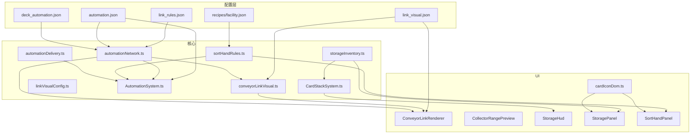

# 物流自动化 V2 · 方案与实现溯源

> **文档版本**：2026-05-30  
> **对应代码**：`web/` 下 TypeScript 源（构建入口 `npm run build`）  
> **关联文档**：[facility-craft-design.md](facility-craft-design.md)（工房叠牌合成）、[game-implementation.md](game-implementation.md)

---

## 1. 背景与迭代溯源

| 阶段 | 设计 | 状态 |
|------|------|------|
| V0 | 收集 → 传送 → 仓储，仓库直供工房 | 已废弃 |
| V1 | 增加 `auto_sorter` 分类器 + 白名单规则 | 已从卡组移除 |
| V1.5 | 工房单击 `FacilityPanel` 选生产配方 + `preferredRecipeId` | 已移除 |
| **V2（当前）** | **分拣手** 选配方/原料 → 连边供料；仓储/分拣手 HTML 网格 UI | **已实现** |
| V2.1 | 连边视觉升级（折线/箭头/角色色/物流包动画）+ 拖拽预览 + 仓储不叠牌 | **已实现** |

**核心决策（V2）**

1. **生产意图不在工房设置**，改由 **分拣手** 配置「要送往工房的原料/配方」。
2. **连边拓扑配置化**：`link_rules.json` 定义合法角色与出入度，邻近自动建图。
3. **数值与半径配置化**：`automation.json` 统一 `linkRadius`、`pickupRadius`、`tick` 等。
4. **UI 与商店对齐**：仓储、分拣手使用 HTML 卡牌网格 + Phaser 图标纹理（`cardIconDom`）。
5. **连边视觉配置化**：`link_visual.json` 定义角色配色、箭头、虚线、物流包圆点等；禁止在渲染代码硬编码 cardId。
6. **仓储只显示底牌**：入库物资保留 stack 数据，棋盘上不叠物理牌，由 `StorageHud` 摘要 + 面板查看。

---

## 2. 目标行为（玩家视角）

### 2.1 完整链路

```
地面资源
  → 收集探头（拾取）
  → 传送节点（中继）
  → 投放仓储（入库）
  → 分拣手（按所选配方/原料筛选）
  → 锈蚀工房等（autoFeed 自动叠料合成）
```

- 可摆 **多条**「收集 → 传送 → 仓储」并行入库。
- 每条链路的 **分拣手 → 工房** 独立配置。
- 工房仍按 **堆料 + 配方表** 自动匹配合成（`CraftStationSystem` + `findFacilityRecipe`），**不再**单击工房选配方。

### 2.2 连边规则与视觉

- 设备 **中心距 ≤ `linkRadius`（120px）** 时自动连边（逻辑见 `buildProximityEdges`）。
- **连线渲染**（`ConveyorLinkRenderer` + `link_visual.json`）：
  - **L 型折线**（水平/垂直优先，减少交叉），**方向箭头**标出物流流向。
  - **按角色配色**（配置键 `fromRole→toRole`）：

    | 连接 | 默认色 | 含义 |
    |------|--------|------|
    | 收集 → 传送 | `#5a9a68` 绿 | 入库链起点 |
    | 传送 → 仓储 | `#6a8ab8` 蓝 | 中继 |
    | 仓储 → 分拣手 | `#b89458` 琥珀 | 出库 |
    | 分拣手 → 工房 | `#9a7ab8` 紫 | 供料 |

  - **状态线型**：
    - **就绪链**（两端均不在 `unlinked`）：实线、高 alpha。
    - **无效/待补链**（有边但未入 active chain）：虚线、降 alpha（`inactiveAlpha`）。
    - **拖拽预览**（涉及正在拖动的设备）：蓝色虚线预览（`previewEdgeColor`）；拖拽时 **实时** `buildAutomationGraph` 重算拓扑，松手前即可见连/断变化。
  - **物流包**：链上 `packet` 沿边插值绘制小圆点（`packetDotSize`）；`blocked` 时变红静止（`blockedColor`）。
  - **待连边设备**：卡牌外 **琥珀色正弦脉冲圈**（`endpointColor` + `endpointPulseMs`）；**正在拖拽的卡不画此圈**，避免与范围预览叠层。
- 合法有向连接（见 §4.1）：
  - `logistics_collect` → `auto_relay`
  - `auto_relay` → `logistics_depot`
  - `logistics_depot` → `logistics_sorter`
  - `logistics_sorter` → `logistics_facility`

### 2.3 范围显示（仅拖拽）

| 设备 | 拾取范围 | 连边范围 | 说明 |
|------|----------|----------|------|
| 收集探头 | 淡绿填充 182px | 单圈蓝线 120px | 同时显示时 **只画一条蓝圈 + 淡绿底**，不再叠多层装饰圈 |
| 传送 / 仓储 / 分拣手 | 无 | 单圈蓝线 120px | 范围内合法目标显示 **候选高亮圈** |
| 工房 / 炮塔等 | 不显示物流圈 | 不显示物流圈 | — |

实现：`CardDragSystem.updateRangePreviews` + `CollectorRangePreview` + `ConveyorLinkRenderer.setDragPreview`。

- **放置后无常驻圈**（已移除 `CollectorRangeOverlay`）。
- **拖拽提示**（`StackDropHint`）：`getAutomationLinkHint` 按缺口角色与距离输出，如「靠近传送器还差 32px」「范围内有传送器，松手即可连接」（文案用 `link_visual.json` → `roleLabels`）。

**曾有问题（已修复）**：拾取/连边各画双圈 + 待连边脉冲圈 + 拖拽圈叠在一起，同心圆过多；现每层最多一条线，拖拽卡隐藏脉冲圈。

### 2.4 仓储面板与牌面展示

- 单击仓储底牌 → HTML 面板（与商店同布局：4 列网格、卡牌色块 + **图标**）。
- **左键拖卡牌到牌桌** → 按当前数量设置取出（与商店拖购一致，Phaser 幽灵卡）。
- **右键卡牌** → 一次取满该种类。
- **`− / +`** → 调整本次拖出数量。
- **棋盘叠牌**：入库物资 **不在仓储底牌上叠物理牌**（`CardStackSystem.layoutStack` 对 `isStorageMember` 设 `visible=false`）；库存仍存于 stack.members，**`StorageHud`** 在底牌下方显示容量条与摘要（如 `零件×4 · 2/16`）。自动化 `deliverToWarehouse` / `pullFromStorageMember` 逻辑不变。

### 2.5 分拣手面板

- 单击分拣手底牌 → HTML 配方网格。
- 读取 **已连接工房** 的 `stationId`，列出该工房 **全部可用配方**（过滤 `dayMin`）。
- 每张卡：**产出物图标/名称**；下方 **原料摘要**（如 `零件×2 + 木板×1`）。
- 点击配方 → 写入分拣手的 `sortFilterCardId` = 该配方 **第一个带 `cardId` 的 input**。
- 未连工房 → 提示「请先将分拣手靠近工房」。

> **与概念稿差异**：部分 UI 稿（如牌面旁常驻「分拣手 N 级 / 物品 / 连接到…」）**当前未实现**；状态仅在打开面板或物流 toast 中体现。牌面等级系统未接入。

---

## 3. 架构与数据流

### 3.1 模块关系



### 3.2 每 tick 顺序（`AutomationSystem.tick`）

1. `rebuildChains()` — 邻近建图，缓存至 `REGISTRY_AUTOMATION_GRAPH`
2. `runCollectors()` — 收集探头吸地面资源 → 生成 packet
3. `runHops()` — packet 沿边多跳；到仓储则 `deliverToWarehouse`；到工房则 `deliverToCraftStation`；经分拣手时校验 `sortFilterCardId`
4. `runSortHandTransfers()` — 分拣手→工房：从 **上游仓储** `pullFromStorageMember`，再 `deliverToCraftStation`（每 tick 上限 `maxPullPerTick`）
5. `emitLaneStatus()` — 传送状态 toast 源

### 3.3 图构建要点（`buildProximityEdges`）

- 设备集合：`collectLogisticsDevices`（automation 建筑 + `logistics_facility` 工房）。
- 角色解析：`getLogisticsRole(tags)` — **必须**包含 `logistics_sorter`，否则分拣手无法连边（2026-05-30 修复项）。
- 按 `priority` 排序规则，贪心连最近候选，检查 `maxOut` / `maxIn`、防环。
- 收集链入队条件：从收集器 BFS 可达 **传送 + 仓储**。

### 3.4 分拣手状态存储

| 键 | 位置 | 含义 |
|----|------|------|
| `sortFilterCardId` | `GameCard.setData`（`SORT_FILTER_CARD_KEY`） | 当前要分拣/供料的 **原料 cardId** |

不写入 JSON 存档字段；随场景内卡牌实例存在。

### 3.5 连边渲染数据流（V2.1）

```
stack-changed / card-spawned / automation-graph-updated
  → ConveyorLinkRenderer.scheduleRefresh()
  → computeAutomationLinks(scene, config, dragPreview?)
       ├─ 常态：readAutomationGraph(registry)
       └─ 拖拽：buildAutomationGraph(实时坐标)
  → ConveyorLinkRenderer.drawGraphics()  // 50ms 动画 tick 亦会重绘

CardDragSystem 拖拽 logistics 卡
  → setDragPreview(card) + CollectorRangePreview(单圈 + candidates)
  → getAutomationLinkHint → StackDropHint
```

快照类型：`AutomationLinkSnapshot`（`edges` / `unlinked` / `previewEdges`）。边状态：`active` | `inactive` | `preview`；packet 进度来自 `chain.packets[].hopTimer / linkTransitSeconds`。

---

## 4. 配置文件

### 4.1 `web/public/data/logistics/link_rules.json`

```json
{
  "connections": [
    { "from": "logistics_collect", "to": "auto_relay", "maxOut": 1, "maxIn": 1 },
    { "from": "auto_relay", "to": "logistics_depot", "maxOut": 1, "maxIn": 4 },
    { "from": "logistics_depot", "to": "logistics_sorter", "maxOut": 1, "maxIn": 1 },
    { "from": "logistics_sorter", "to": "logistics_facility", "maxOut": 2, "maxIn": 2 }
  ]
}
```

角色 tag 与卡牌对应见 §5.1。

### 4.2 `web/public/data/logistics/automation.json`

| 字段 | 默认 | 说明 |
|------|------|------|
| `linkRadius` | 120 | 连边距离（px） |
| `collectorPickupRadius` | 182 | 收集默认拾取半径（卡面可覆盖） |
| `tickSeconds` | 1.2 | 物流 tick 间隔 |
| `linkTransitSeconds` | 1.5 | packet 每跳停留时间 |
| `maxPacketsPerChain` | 6 | 单链最大在途包 |
| `maxPullPerTick` | 1 | 分拣手→工房每 tick 供料次数 |

Registry：`REGISTRY_AUTOMATION_CONFIG`。

### 4.3 `web/public/data/logistics/link_visual.json`

连边 **视觉** 配置（与 §4.1 拓扑规则分离）。Registry：`REGISTRY_LINK_VISUAL`。

| 字段 | 说明 |
|------|------|
| `edgeStyles` | 键 `"logistics_collect→auto_relay"` 等 → `{ color, width }` |
| `activeEdgeColor` / `inactiveEdgeColor` / `previewEdgeColor` | 无专属 `edgeStyles` 时的回退色 |
| `inactiveAlpha` / `previewAlpha` | 无效边 / 拖拽预览透明度 |
| `endpointColor` / `endpointPulseMs` | 待连边脉冲圈 |
| `blockedColor` / `packetDotSize` | 物流包圆点 |
| `arrowSize` / `dashLength` / `dashGap` | 箭头与虚线 |
| `roleLabels` | 拖拽/点击 hint 中的角色中文名 |

解析：`web/src/core/linkVisualConfig.ts` → `parseLinkVisual`。

### 4.4 自动化卡组 `deck_automation.json`（4 张）

| id | 名称 | 物流角色 tag | 关键 effect |
|----|------|--------------|-------------|
| `auto_collector` | 收集探头 | `logistics_collect` | `auto_collector.pickupRadius: 182` |
| `auto_receiver` | 传送节点 | `auto_relay` | `auto_relay` |
| `auto_sort_hand` | 分拣手 | `logistics_sorter` | `sort_hand.blockUnmatched: true` |
| `auto_chest` | 投放仓储 | `logistics_depot` + `warehouse` | `auto_storage.maxStored: 16` |

### 4.5 工房侧

- 卡牌：`deck_facility.json` 中 `facility_workshop` 等带 `logistics_facility` + `craft_station`。
- 自动供料：`effects.autoFeed: true`，`feedPerTick` 可覆盖全局。
- 配方：`recipes/facility.json`，按 `stationId` 与 `dayMin` 过滤。

---

## 5. 代码地图（影响文件）

### 5.1 核心逻辑

| 路径 | 职责 |
|------|------|
| `web/src/core/linkRules.ts` | 连边规则解析、`getLogisticsRole` |
| `web/src/core/linkVisualConfig.ts` | `link_visual.json` 解析、`hexToNumber`、`edgeStyleKey` |
| `web/src/core/conveyorLinkVisual.ts` | 连边快照、`computeAutomationLinks`、packet 可视化、`getAutomationLinkHint` |
| `web/src/core/automationNetwork.ts` | 建图、链、边查询、`previewProximityEdges`、`getMissingLinkHint` |
| `web/src/core/automationConfig.ts` | 数值配置 parse |
| `web/src/core/automationDelivery.ts` | 入仓、入工房、`stationNeedsCard`、`facilityAutoFeedEnabled` |
| `web/src/core/sortHandRules.ts` | 分拣偏好、`listSortRecipesForHand`、`getLinkedFacilityForSortHand` |
| `web/src/core/storageInventory.ts` | 仓储成员、`withdrawFromStorage`（支持指定落点 `at`） |
| `web/src/systems/AutomationSystem.ts` | tick 主循环 |
| `web/src/systems/CraftStationSystem.ts` | 工房合成（`findFacilityRecipe`，无 preferred 分支） |
| `web/src/systems/SortHandBuildingSystem.ts` | 单击分拣手 → `sort-hand-panel-open` |
| `web/src/systems/StorageBuildingSystem.ts` | 单击仓储 → `storage-panel-open` |
| `web/src/systems/CardStackSystem.ts` | 叠牌布局；仓储 `isStorageMember` **隐藏**、`visibleStackMembers` 修正 hit/ pile  bounds |
| `web/src/systems/CardDragSystem.ts` | 物流范围预览、`setDragPreview`、~12Hz 连边刷新 |

### 5.2 UI

| 路径 | 职责 |
|------|------|
| `web/src/ui/StoragePanel.ts` | 仓储 HTML 网格 + 拖出 |
| `web/src/ui/SortHandPanel.ts` | 分拣手 HTML 配方网格 |
| `web/src/ui/TradePanel.ts` | 商店（同套图标 `cardIconDom`） |
| `web/src/ui/cardIconDom.ts` | Phaser 纹理 → HTML `` |
| `web/src/ui/StorageHud.ts` | 仓储底牌容量条 + 库存摘要（替代叠牌展示） |
| `web/src/ui/CollectorRangePreview.ts` | 拾取淡填充 + 单圈连边 + 候选高亮 |
| `web/src/ui/ConveyorLinkRenderer.ts` | 折线/箭头/虚线/物流包/脉冲；读 `conveyorLinkVisual` 快照 |
| `web/index.html` | `#storage-panel` / `#sort-hand-panel` 共用 `.trade-panel` 样式 |

### 5.3 场景与开局

| 路径 | 职责 |
|------|------|
| `web/src/scenes/GameScene.ts` | 挂载系统/面板、`REGISTRY_LINK_VISUAL`、`storagePanel.setPlayfield` |
| `web/src/scenes/PreloaderScene.ts` | 预加载 `logistics_link_visual.json` |
| `web/src/config/starterBoardLayout.ts` | 双行「收集→传送→仓→分拣手」+ 分拣手下工房 |
| `web/public/data/guide/player_guide.json` | 玩家图鉴「物流」章节 |

### 5.4 已移除 / 遗留未用

| 路径 | 说明 |
|------|------|
| `FacilityPanel.ts` / `FacilityBuildingSystem.ts` | 工房选配方 UI — **GameScene 已不挂载** |
| `craftStationPrefs.ts` / `resolveFacilityCraftMatch` | preferred 配方 — **CraftStation 已改回 `findFacilityRecipe`** |
| `CollectorRangeOverlay.ts` | 常驻绿圈 — **已停用** |
| `sorterRules.ts`（`auto_sorter`） | 旧分类器规则 — 无对应卡牌时不走逻辑 |

---

## 6. 开局演示布局

`computeStarterLogisticsLayout`（`starterBoardLayout.ts`）：

- **2 行** 并行：`auto_collector → auto_receiver → auto_chest → auto_sort_hand`，间距 `LOGISTICS_HOP = 82`（< 120）。
- **主行** 分拣手正下方：`facility_workshop`（`anchorCol: 3`）。
- 地面演示物资 + 主仓 seed `scrap×4`；分拣手默认 `sortFilterCardId = scrap`。

---

## 7. 性能与事件约定

| 机制 | 说明 |
|------|------|
| `REGISTRY_AUTOMATION_GRAPH` + `EVENT_AUTOMATION_GRAPH_UPDATED` | 图缓存，避免 UI 每帧重建 |
| `AutomationSystem.scheduleRebuild()` | `stack-changed` 等合并到下一帧 |
| `CardDragSystem.maybeRefreshAutomationLinks()` | 拖拽连边预览 ~12Hz 限流 + `ConveyorLinkRenderer.setDragPreview` |
| `ConveyorLinkRenderer` | 50ms 动画 tick 重绘 Graphics；拓扑仅在 refresh / 拖拽时重算 |
| 拖拽中 `computeAutomationLinks(..., dragPreview)` | 调用 `buildAutomationGraph` 实时位置建图 |
| 仓储隐藏成员 | `layoutStack` + `refreshStorageHuds` 同步 `visible=false`，不参与 `findCardUnder` |

---

## 8. 已知限制与后续可扩展

1. **分拣配方筛选**：仅展示 inputs 中含 **显式 `cardId`** 的配方；纯 `tag` 原料配方不会出现在分拣手面板。
2. **多原料配方**：点击后只设置 **第一个** `cardId` 为分拣目标；其余原料依赖工房 `autoFeed` 与堆料匹配，或需多次配置/扩展为多选。
3. **分拣手等级 / 牌面状态 HUD**：概念稿中的「N 级、连接到 XXX」**未实现**；可新增 `StorageHud` 式组件或卡牌 overlay。
4. **存档**：`sortFilterCardId` 在 `GameCard` data 上，持久化需随存档系统一并序列化。
5. **图鉴文案**：`player_guide.json` 仓储一节仍写「左键点一行取 1」，与当前 **拖出** 交互略有出入，宜同步改文案。
6. **连边悬停高亮 / 多链色相 / 分拣出口标签**：V2.1 未做，见早期 polish  backlog。

---

## 9. 变更检查清单（改动物流时）

- [ ] `link_rules.json` 角色 tag 与 `deck_automation.json` / `deck_facility.json` 一致
- [ ] `link_visual.json` 新增连接类型时补 `edgeStyles` 与 `roleLabels`
- [ ] `getLogisticsRole` 包含新增角色
- [ ] `AutomationSystem` tick 路径是否需新模块
- [ ] 分拣/仓储 UI 是否复用 `cardIconDom` + `.trade-panel` 样式
- [ ] `player_guide.json` / shop / packs 文案与卡组同步
- [ ] `npm run build` 通过
- [ ] 更新本文档 **文档版本** 与 §1 溯源表

---

## 10. 快速验证步骤

1. 刷新进入游戏 → 底部应有双行物流 + 分拣手下工房，**彩色折线 + 箭头** 连通。
2. 拖拽 **收集探头** → **淡绿底 + 单条蓝圈**（无多层同心圆）；拖近传送器见 **虚线预览 + 距离 hint**。
3. 单击 **投放仓储** → 网格带图标；棋盘上 **仅底牌 + 底部容量条**，无资源叠牌；拖卡牌到牌桌取出。
4. 单击 **分拣手** → 见锈蚀工房配方列表；选配方后 toast「分拣原料：…」。
5. 地面放零件 → 自动入库（底牌摘要更新）→ 分拣手供料到工房 → 链上可见 **物流包圆点** 移动。

---

*本文档随 V2 物流实现编写，用于需求—配置—代码三方溯源。重大行为变更请在本文件 §1 追加一行并更新版本日期。*
