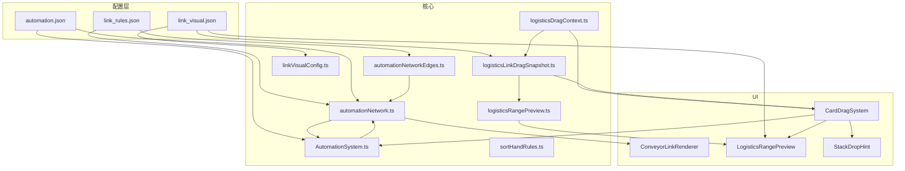

# 物流自动化 V2 · 方案与实现溯源

> **文档版本**：2026-06-03  
> **对应代码**：`web/` 下 TypeScript 源（`npm run build` / `npm test`）  
> **关联文档**：[facility-craft-design.md](facility-craft-design.md)（工房叠牌合成）、[game-implementation.md](game-implementation.md)

---

## 1. 背景与迭代溯源

| 阶段 | 设计 | 状态 |
|------|------|------|
| V0 | 收集 → 传送 → 仓储，仓库直供工房 | 已废弃 |
| V1 | 增加 `auto_sorter` 分类器 + 白名单规则 | 已从卡组移除 |
| V1.5 | 工房单击 `FacilityPanel` 选生产配方 + `preferredRecipeId` | 已移除 |
| **V2（当前）** | **分拣手** 选配方/原料 → 连边供料；仓储/分拣手 HTML 网格 UI | **已实现** |
| V2.1 | 连边视觉（折线/箭头/角色色）+ 拖拽范围预览 + 仓储不叠牌 | **已实现** |
| **V2.2** | **稳定建图**（incumbent 锁定 + mover 抢占）+ 拖拽 diff 预览 + `linkHints` 文案 | **已实现** |
| **V3** | **Relay 总线**：按传送聚合包裹；通用路径判定；储物棚/投放仓储经传送支持卖/存/供料；`depot→relay` | **已实现** |
| **V3.1** | **禁止储物棚↔工房直连**；供料须经 `warehouse → relay → 分拣手(feed) → 工房` | **已实现** |
| **V3.2** | 同一储物棚最多 **4** 条分拣手入边（`sorter→warehouse` `maxIn:4`），支持多路存仓汇入 | **已实现** |
| **V3.3（当前）** | 分拣手下游按 **sortMode** 建边（存仓只连储物棚）；工房产出仅在有可投递分拣手时吸收 | **已实现** |

**核心决策（V2）**

1. **生产意图不在工房设置**，改由 **分拣手** 配置「要送往工房的原料/配方」。
2. **连边拓扑配置化**：`link_rules.json` 定义合法角色与出入度，邻近自动建图。
3. **数值与半径配置化**：`automation.json` 统一 `linkRadius`、`pickupRadius`、`tick` 等。
4. **UI 与商店对齐**：仓储、分拣手使用 HTML 卡牌网格 + Phaser 图标纹理（`cardIconDom`）。
5. **连边视觉配置化**：`link_visual.json` 定义角色配色、箭头、虚线、拖拽 hint 等；禁止在渲染代码硬编码 cardId。
6. **仓储只显示底牌**：入库物资保留 stack 数据，棋盘上不叠物理牌，由 `StorageHud` 摘要 + 面板查看。
7. **拖拽可预期（V2.2）**：仅 **正在被拖的物流设备** 可抢占已满 slot；其它设备位置变化不会静默抢边；**预览与松手共用同一套 stable 建图**。

---

## 2. 目标行为（玩家视角）

### 2.1 完整链路

```
地面资源
  → 收集探头（拾取）
  → 传送节点（中继）
  → 分拣手（卖出/买入/存仓/供料 等模式）
  → 投放仓储 / 商店 / 储物棚 / 生产设施 …
```

- 可摆 **多条** 并行链（收集入库、储物棚出库、工房产出回传等）。
- 分拣手 **模式**（`sortMode`）决定下游目标角色：商店、储物棚、工房等。
- 工房仍按 **堆料 + 配方表** 自动匹配合成（`CraftStationSystem` + `findFacilityRecipe`）。

### 2.2 连边规则与视觉

- 设备 **中心距 ≤ `linkRadius`（220px）** 时参与建图（逻辑见 `buildProximityEdgesStable`，§3.3）。
- **棋盘连线**（`ConveyorLinkRenderer` + `link_visual.json`）：
  - **L 型折线** + **方向箭头**；按 `edgeStyles` 中 `fromRole→toRole` 配色。
  - **有效链**（`isAutomationEdgeActive` / `isSourceRelayPathActive`）：源→传送→分拣手(模式匹配下游) 完整时实线、高 alpha。
  - **无效边**（有拓扑但未形成完整 active chain）：降 alpha（`inactiveAlpha`）。
  - **物流包**：链上 packet 沿边插值圆点；阻塞时 `blockedColor`。
- **合法连接类型** 以 `link_rules.json` 为准（节选）：

  | from | to | 说明 |
  |------|-----|------|
  | `logistics_collect` | `auto_relay` | 收集 → 传送 |
  | `auto_relay` | `logistics_sorter` | 传送 → 分拣手（分拣手总入度 1） |
  | `logistics_sorter` | `shop` / `warehouse` / `logistics_facility` / `logistics_depot` | 分拣下游；**同一储物棚最多 4 个分拣手入边**（多路存仓） |
  | `warehouse` | `auto_relay` | 储物棚出库（须经传送+分拣手供料） |
  | `logistics_facility` | `auto_relay` | 工房产出回传 |
  | `logistics_depot` | `auto_relay` | 投放仓储 → 传送 |
  | `logistics_depot` | `logistics_facility` | 投放仓储直供工房 |

### 2.3 拖拽连边预览（V2.2）

| 设备 | 拾取范围 | 连边范围 | 预览 |
|------|----------|----------|------|
| 收集探头 | 淡绿填充 182px | 蓝圈 220px | 见下表 |
| 传送 / 仓储 / 分拣手 / 储物棚 / 工房等 | 无 | 蓝圈 220px | 见下表 |
| 非物流卡 | — | — | 无物流预览 |

实现：`CardDragSystem.updateRangePreviews` → `computeLogisticsDragSnapshot` → `LogisticsRangePreview` + `StackDropHint`。

| 预览状态 | 视觉 | 文案（`link_visual.json` → `linkHints`） |
|----------|------|------------------------------------------|
| 将新增/保持连边 | 实线 + 箭头；**新增**目标 **琥珀高亮圈** | `willConnect` / `inRangeConnect` |
| 将断开 | **红色虚线**（`breakEdgeColor`） | `willDisconnect` |
| 槽位被占无法连 | **暗红虚线** + 灰色候选圈 | `slotTaken` |
| 最近目标在圈外 | 仅蓝圈 + hint | `tooFar`（`{distance}` = 还差 px） |

- **放置后无常驻拾取/连边圈**。
- **拖拽中棋盘折线**：`AutomationSystem` 在 `automation-graph-refresh-request` 下 ~12Hz 用 mover 坐标重算图（`REGISTRY_AUTOMATION_GRAPH`），`ConveyorLinkRenderer` 同步更新。
- **预览 = 松手**：`computeLogisticsDragSnapshot` 与 `buildAutomationGraph(..., dragOpts)` 使用同一 `buildProximityEdgesStable` 路径。

### 2.4 连边抢占（玩家可预期规则）

| 场景 | 行为 |
|------|------|
| 两个收集器争一个传送器 | **未拖动**时：先连上的（incumbent）保持，更近者 **不会** 静默抢边 |
| 拖动收集器靠近已被占用的传送器 | **更近** 则松手后抢占；否则预览 **slotTaken** + 暗红虚线 |
| 两个传送器争一个分拣手 | 非 mover 不抢；mover 传送器 **更近** 可抢分拣手入边 |
| 拖动分拣手在多个工房间 | mover 分拣手可改连 **更近** 的工房下游 |
| 拖出 `linkRadius` | 预览断链（红虚线），松手后该设备相关边移除 |

### 2.5 仓储面板与牌面展示

- 单击仓储底牌 → HTML 面板（4 列网格、图标）。
- **左键拖出** / **右键取满** / **`− / +`** 调整数量。
- 棋盘上 **仅底牌 + `StorageHud` 摘要**；`stack.members` 隐藏不挡点击。

### 2.6 分拣手面板

- 单击分拣手 → 配方/商店列表（依 `sortMode` 与已连目标）。
- `sortFilterCardId`、`sortMode`、`sortHandWeight` 存于 `GameCard` data。
- 未连目标 → 面板/ toast 提示先连边。

---

## 3. 架构与数据流

### 3.1 模块关系



### 3.2 每 tick 顺序（`AutomationSystem.tick`）

1. `rebuildChains()` — stable 建图 → `REGISTRY_AUTOMATION_GRAPH`
2. `runCollectors()` — 收集 → packet
3. `runHops()` — packet 多跳；分拣手校验 `sortFilterCardId` / `sortMode`
4. `runSortHandTransfers()` / `runBuyTick` / `runDepotFeed` 等 — 依链类型
5. `emitLaneStatus()` — 传送 toast

### 3.3 稳定建图（`buildProximityEdgesStable`）

文件：`web/src/core/automationNetworkEdges.ts`（纯逻辑，**Vitest 覆盖**）。

**Phase A — Incumbent 锁定**

- 输入 `prevEdges`（上一帧图）。
- 若两端仍在 `linkRadius` 内、角色规则仍合法 → **保留**该边，占用对应 `maxIn` / `maxOut` 计数。

**Phase B — 填充与抢占**

- 按 `link_rules` 的 `priority` 降序处理（`logistics_sorter` 下游单独 `attachSorterDownstreams`）。
- **非 mover**：仅使用空闲 slot，不抢 incumbent。
- **mover**（`moverIds` + `dragPositions`）：`maxIn` / `maxOut` 已满时，若比 incumbent **更近** 则移除 incumbent 并连上。

**分拣手下游**：已有下游且仍在范围内 → 锁定；mover 分拣手可对 **更近** 工房/仓储等切换下游。

**运行时入口**：`buildAutomationGraph` 始终调用 stable；`prevEdges` 来自 registry 当前图。

### 3.4 拖拽快照（`computeLogisticsDragSnapshot`）

文件：`web/src/core/logisticsLinkDragSnapshot.ts`。

```
prevEdges (registry)
  + devices (scene)
  + dragOpts (moverIds, dragPositions)
  → buildProximityEdgesStable → nextEdges
  → diffAutomationEdges → added / removed
  → findBlockedLinks → blocked
  → active = next 中涉及 mover 的边
  → buildDragHint → StackDropPreview
```

### 3.5 事件与刷新

```
stack-changed / card-spawned / card-removed / card-rotated / card-drag-end
  → AutomationSystem.scheduleRebuild()
  → rebuildChains()  // 若正在拖拽，合并 drag.getLogisticsDragContext()

CardDragSystem.applyDrag (物流卡)
  → computeLogisticsDragSnapshot → LogisticsRangePreview + StackDropHint
  → automation-graph-refresh-request（~80ms 节流）
  → rebuildChains() + automation-graph-updated
  → ConveyorLinkRenderer.draw()
```

### 3.6 分拣手状态存储

| 键 | 位置 | 含义 |
|----|------|------|
| `sortFilterCardId` | `GameCard` data | 分拣/供料目标 `cardId` |
| `sortMode` | `GameCard` data | `sell` / `buy` / `store` / `feed` |
| `sortHandWeight` | `GameCard` data | 多分拣手分流权重 |

---

## 4. 配置文件

### 4.1 `web/public/data/logistics/link_rules.json`

完整规则见仓库内文件；每条含 `maxOut`、`maxIn`、`priority`。修改后需与卡组 tag 一致（§9 检查清单）。

### 4.2 `web/public/data/logistics/automation.json`

| 字段 | 默认 | 说明 |
|------|------|------|
| `linkRadius` | 220 | 连边距离（px） |
| `collectorPickupRadius` | 182 | 收集默认拾取半径 |
| `tickSeconds` | 1.2 | 物流 tick |
| `linkTransitSeconds` | 1.5 | packet 每跳时间 |
| `maxPacketsPerRelay` | 6 | 单传送节点在途包上限 |
| `maxInjectPerRelayPerTick` | 1 | 每 tick 每传送最多注入包数 |
| `sourceInjectPriority` | 工房>棚>投放>收集 | 多源争用时的入站顺序 |
| `packetBlockedPurgeTicks` | 12 | 阻塞包裹丢弃 tick 数 |
| `maxPullPerTick` | 1 | 分拣手直连供料（绕过 packet）次数上限 |

Registry：`REGISTRY_AUTOMATION_CONFIG`。

### 4.3 `web/public/data/logistics/link_visual.json`

Registry：`REGISTRY_LINK_VISUAL`（Preloader key：`logistics_link_visual`）。

| 字段 | 说明 |
|------|------|
| `edgeStyles` | `"fromRole→toRole"` → `{ color, width }` |
| `previewEdgeColor` / `previewAlpha` | 拖拽将连上的边 |
| `breakEdgeColor` / `breakAlpha` | 拖拽将断开的边（红虚线） |
| `blockedColor` / `blockedCandidateAlpha` | 被占用无法连 |
| `inactiveAlpha` | 非 active chain 的棋盘边 |
| `dashLength` / `dashGap` | 虚线参数 |
| `roleLabels` | 角色中文名（hint 用） |
| `linkHints` | 拖拽文案模板，支持 `{target}` `{occupant}` `{distance}` `{from}` `{to}` |

| `linkHints` 键 | 默认含义 |
|----------------|----------|
| `willConnect` | 松手后将连接 |
| `willDisconnect` | 将断开某条边 |
| `slotTaken` | 目标已被占用 |
| `tooFar` | 靠近目标还差 N px |
| `inRangeConnect` | 范围内可连，松手即可 |

解析：`linkVisualConfig.ts` → `parseLinkVisual`、`formatLinkHint`。

### 4.4 自动化卡组 `deck_automation.json`

| id | 物流角色 | 说明 |
|----|----------|------|
| `auto_collector` | `logistics_collect` | 拾取地面资源 |
| `auto_receiver` | `auto_relay` | 中继 |
| `auto_sort_hand` | `logistics_sorter` | 分拣/买卖/供料 |
| `auto_chest` | `logistics_depot` + `warehouse` | 投放仓储 |

---

## 5. 代码地图

### 5.1 核心逻辑

| 路径 | 职责 |
|------|------|
| `web/src/core/automationNetworkEdges.ts` | `buildProximityEdges`、`buildProximityEdgesStable`、`diffAutomationEdges`、`deviceDist` |
| `web/src/core/automationNetworkEdges.test.ts` | stable / 抢占单元测试 |
| `web/src/core/automationNetwork.ts` | `buildAutomationGraph`、`collectLogisticsDevices`、链有效性、边查询 |
| `web/src/core/logisticsDragContext.ts` | `logisticsDeviceId`、`buildLogisticsDragOptions` |
| `web/src/core/logisticsLinkDragSnapshot.ts` | `computeLogisticsDragSnapshot`、blocked 检测、hint 生成 |
| `web/src/core/logisticsRangePreview.ts` | `getLogisticsRangeSpec`、`findLogisticsPreviewLinksStable` |
| `web/src/core/linkRules.ts` | 规则解析、`getLogisticsRole` |
| `web/src/core/linkVisualConfig.ts` | 视觉配置解析、`formatLinkHint` |
| `web/src/core/automationConfig.ts` | 数值配置 |
| `web/src/core/automationDelivery.ts` | 入仓、入工房、packet 投递 |
| `web/src/core/sortHandRules.ts` | 分拣模式、配方列表、边查询封装 |
| `web/src/systems/AutomationSystem.ts` | tick、`rebuildChains`、链与 packet |
| `web/src/systems/CardDragSystem.ts` | 拖拽、`getLogisticsDragContext`、范围预览、~12Hz 图刷新 |

### 5.2 UI

| 路径 | 职责 |
|------|------|
| `web/src/ui/LogisticsRangePreview.ts` | 拾取圈、连边圈、预览/断链/blocked 线 |
| `web/src/ui/logisticsLinkDraw.ts` | `drawLShapeLink`、`drawDashedLShapeLink`、`drawLinkArrow` |
| `web/src/ui/ConveyorLinkRenderer.ts` | 棋盘常驻折线（读 registry 图） |
| `web/src/ui/StackDropHint.ts` | 拖拽浮动文案（含物流 hint） |
| `web/src/ui/StoragePanel.ts` / `SortHandPanel.ts` | 仓储 / 分拣手 HTML 面板 |
| `web/src/ui/StorageHud.ts` | 仓储底牌摘要 |

### 5.3 场景

| 路径 | 职责 |
|------|------|
| `web/src/scenes/GameScene.ts` | 挂载系统、`REGISTRY_LINK_VISUAL` |
| `web/src/scenes/PreloaderScene.ts` | 加载 `logistics_link_rules` / `logistics_link_visual` / `logistics_automation` |

### 5.4 已移除 / 不再使用

| 路径 | 说明 |
|------|------|
| `conveyorLinkVisual.ts` | 未实现；由 `automationNetwork` + `ConveyorLinkRenderer` 替代 |
| `CollectorRangeOverlay.ts` | 常驻圈已停用 |
| `FacilityPanel` 选配方 | 已移除 |

---

## 6. 性能与事件约定

| 机制 | 说明 |
|------|------|
| `REGISTRY_AUTOMATION_GRAPH` + `automation-graph-updated` | 图缓存；UI 不每帧重建拓扑 |
| `scheduleRebuild()` | `stack-changed` 等合并到 POST_UPDATE |
| `automation-graph-refresh-request` | 拖拽物流卡时 ~12Hz 触发 `rebuildChains`（带 `dragOpts`） |
| `ConveyorLinkRenderer` | 50ms 重绘 Graphics；拓扑随 graph-updated 变 |
| `npm test` | `automationNetworkEdges.test.ts`、`linkVisualConfig.test.ts` |

---

## 7. 已知限制与后续可扩展

1. **分拣配方**：面板仍偏「第一个 `cardId` input」；多原料配方依赖工房 `autoFeed`。
2. **牌面状态 HUD**：分拣手等级/常驻连接名未做。
3. **存档**：`sortFilterCardId` / `sortMode` 需随存档序列化。
4. **图鉴**：`player_guide.json` 仓储交互文案可能与拖出不一致。
5. **棋盘边 inactive 虚线**：`ConveyorLinkRenderer` 仅区分 active chain alpha，未单独画「待补链」虚线。
6. **连边悬停高亮 / 分拣出口标签**：未做。

---

## 8. 变更检查清单（改动物流时）

- [ ] `link_rules.json` 与卡组 `tags` 一致
- [ ] 新连接类型补 `link_visual.json` 的 `edgeStyles`、`roleLabels`
- [ ] 新 hint 场景补 `linkHints` 模板
- [ ] `getLogisticsRole` 覆盖新角色
- [ ] `AutomationSystem` tick / 投递路径
- [ ] `automationNetworkEdges.test.ts` 补抢占用例
- [ ] `npm test` + `npm run build`
- [ ] 更新本文档 **文档版本** 与 §1 溯源表

---

## 9. 综合演示场布局（`test` 模式）

`web/src/config/starterBoardLayout.ts` → `computeStarterLogisticsLayout` 在开局自动生成三条链：

| 链路 | 采集 | 合成设施 | 存仓分拣 | 中枢 |
|------|------|----------|----------|------|
| 林木 | 枯木林 + 粗木段 | 锈蚀工房（粗木→木板） | 存入仓库·**全部** | 储物棚 |
| 纤维 | 锈灌木 + 植物纤维 | 锈蚀工房（纤维→粗麻绳） | 存入仓库·**粗麻绳** | 同上 |
| 卖出 | — | — | 卖出·**木板** | 储物棚 → 贸易站 |

原则：**每条链独立传送节点**；两条存仓分拣手汇入同一储物棚（`sorter→warehouse` `maxIn:4`）；林木线勿对粗木再开「直接存棚」以免占满 8 格容量。

## 10. 快速验证步骤

1. 进入游戏 → 物流链 **彩色折线 + 箭头**；收集/传送/分拣手连通。
2. 拖 **收集探头** → 淡绿底 + 蓝圈；靠近空传送器 → 琥珀高亮 +「松手后将连接传送节点」。
3. 第二个收集器靠近 **已被占用** 的传送器 → 暗红虚线 +「已被…占用」；拖近抢边 → 红虚线显示将断开旧边、预览新边。
4. 拖 **传送节点** 争 **分拣手** → 验证非拖动时不抢、拖动更近时可抢。
5. 单击 **投放仓储** / **分拣手** → 面板与图标正常；物流包在链上移动。
6. `cd web && npm test` → 12 tests passed.

---

*本文档用于需求—配置—代码三方溯源。重大行为变更请在本文件 §1 追加一行并更新版本日期。*
